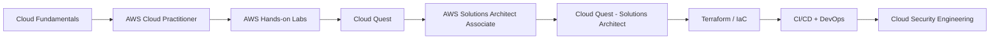

# ☁️ Cloud Infrastructure & AWS Lab


*Cloud Lab banner — this repository documents my progression from cloud fundamentals to AWS architecture, infrastructure automation, security, and DevOps.*

> **Hands-on Cloud Engineering Portfolio**  
> AWS • Networking • Infrastructure • Automation • Security • DevOps

This repository documents my practical cloud learning path through **AWS hands-on labs, infrastructure administration, networking, automation, virtualization, and cloud security**.

The goal is not only to prepare for certifications, but to demonstrate practical work: configuration, architecture decisions, troubleshooting, documentation, and security controls.

---

## 🎯 Current Focus

| Track | Status | Focus |
|---|---|---|
| AWS Cloud Practitioner | 🟢 Active | Core AWS services, cloud concepts, IAM, networking, storage, databases, pricing and security |
| AWS Hands-on Labs / Cloud Quest | 🟢 Active | Practical AWS exercises and troubleshooting |
| Ansible Infrastructure Automation | 🟢 Active | Inventories, playbooks, roles, templates and EC2 automation |
| Cloud Security | 🟢 Active | Shared responsibility, IAM, encryption, network security and risk |
| Proxmox / Virtualization | 🟢 Active | VMs, storage, networking and administration |
| AWS Solutions Architect Associate | 🟡 Coming next | Architecture, resiliency, performance, networking and cost optimization |
| AWS Cloud Quest — Solutions Architect | 🟡 Coming next | Scenario-based architecture labs |
| Terraform / Infrastructure as Code | 🔵 Roadmap | Repeatable AWS infrastructure deployments |
| CI/CD + Cloud DevOps | 🔵 Roadmap | Git-based automation, pipelines and deployment workflows |

---

## 🧭 Learning Roadmap



The progression is intentionally practical:

**Foundations → AWS services → hands-on labs → solutions architecture → automation → DevOps → cloud security**

---

## 🧪 AWS Cloud Practitioner Labs

The `aws-cloud-practitioner/` section contains hands-on exercises covering topics such as:

- IAM users, groups, roles, and managed policies
- EC2 instance deployment and management
- EBS and AMI lifecycle
- Auto Scaling
- Application Load Balancing
- VPC networking and security
- S3 storage and static website hosting
- RDS / relational databases
- DynamoDB / NoSQL
- EFS shared storage
- Event-driven monitoring
- High-availability architectures
- AWS pricing and cloud economics

➡️ See [`aws-cloud-practitioner/`](aws-cloud-practitioner/)

---

## 🏗️ AWS Solutions Architect Associate — Coming Next

The next AWS phase will focus on architecture rather than only individual services.

Planned topics include:

- Multi-AZ and highly available architectures
- Public and private subnet design
- Route tables, Internet Gateways and NAT Gateways
- Security Groups and Network ACLs
- Elastic Load Balancing and Auto Scaling
- EC2 architecture and storage design
- S3 architecture, lifecycle and data protection
- RDS, Aurora and DynamoDB architecture
- Route 53 and DNS
- CloudFront
- VPC endpoints and private connectivity
- IAM roles and least privilege
- Monitoring with CloudWatch
- Event-driven and serverless architecture
- Backup, disaster recovery and resilience
- Cost optimization

This section will also document **AWS Cloud Quest — Solutions Architect** labs as they are completed.

➡️ See [`aws-solutions-architect/`](aws-solutions-architect/)

---

## 🤖 Featured Automation Project

### Ansible WordPress Automation Lab

The Ansible section documents infrastructure automation including:

- static inventories in INI and YAML;
- host groups and variables;
- ad hoc commands;
- Apache and PostgreSQL playbooks;
- facts, conditions, loops and tags;
- Jinja2 templating;
- Ansible roles;
- WordPress deployment on AWS EC2;
- Nginx, MySQL and PHP-FPM;
- troubleshooting SSH, HTTP access and AWS Security Groups.

➡️ See [`ansible/`](ansible/)

---

## 🗂️ Repository Structure

```text
cloud-lab/
├── README.md
├── assets/
│   └── cloud-lab-banner.png
├── ansible/
├── aws-cloud-practitioner/
├── aws-solutions-architect/
├── cloud-fundamentals/
├── cloud-security/
├── docs/
├── projects/
└── proxmox/
```

---

## 🔐 Security Principles

This repository is a public learning portfolio. It must never contain:

- AWS access keys or secret keys;
- `.pem` private keys;
- production credentials;
- real passwords;
- Vault password files;
- API secrets;
- confidential customer or company data.

Example values and sanitized screenshots are used whenever required.

---

## 🚀 Portfolio Goal

This repository is designed to demonstrate a growing ability to work across:

**Cloud Infrastructure • AWS • Networking • Linux • Automation • Security • DevOps**

Each new lab should show not only *what* was configured, but also:

1. **Objective** — what problem the lab solves.
2. **Architecture** — how the services fit together.
3. **Implementation** — configuration steps or commands.
4. **Security** — controls and least-privilege considerations.
5. **Troubleshooting** — problems encountered and how they were solved.
6. **Evidence** — sanitized screenshots, diagrams, or command output.
7. **Key takeaways** — what was learned.

---

## 👤 Author

**Laurent Mandine**

Infrastructure & Cybersecurity practitioner building hands-on skills across AWS, networking, automation, cloud security, OT/ICS, and DevOps.
