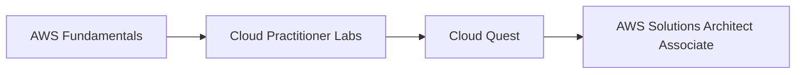

# AWS Cloud Practitioner — Hands-on Labs

This section documents my AWS Cloud Practitioner learning path through practical labs, Cloud Quest exercises, architecture notes, and troubleshooting.

The objective is to connect AWS theory with hands-on experience before progressing to the **AWS Solutions Architect Associate** track.

---

## Topics Covered

- AWS global infrastructure
- IAM users, groups, roles and policies
- EC2 instances
- EBS volumes and AMIs
- Auto Scaling
- Elastic Load Balancing
- VPC networking
- Security Groups
- S3
- EFS
- RDS
- DynamoDB
- High availability
- Monitoring and event-driven services
- AWS pricing and cloud economics
- Shared responsibility model

---

## Lab Documentation Standard

Each lab should contain, when applicable:

```text
README.md
screenshots/
architecture/
commands/
policies/
```

The README should explain:

1. Lab objective
2. AWS services used
3. Architecture
4. Implementation steps
5. Security considerations
6. Troubleshooting
7. Validation
8. Key takeaways

---

## Progression



Next step: [`../aws-solutions-architect/`](../aws-solutions-architect/)
