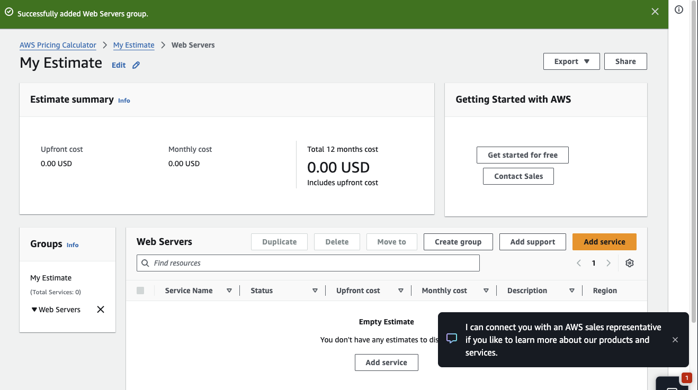
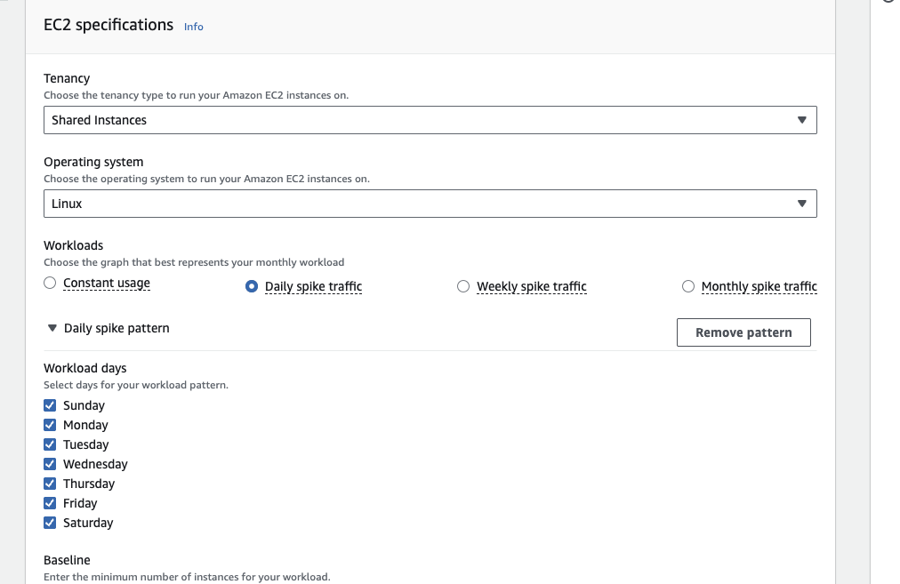
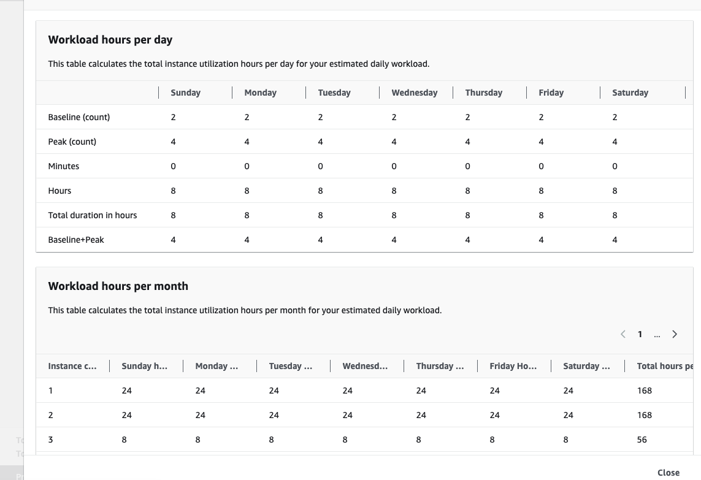
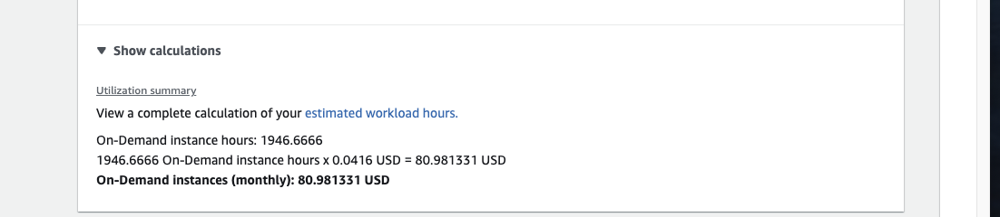
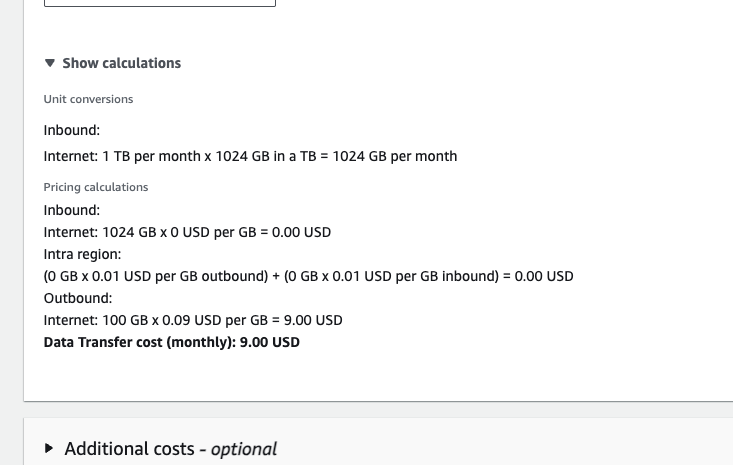
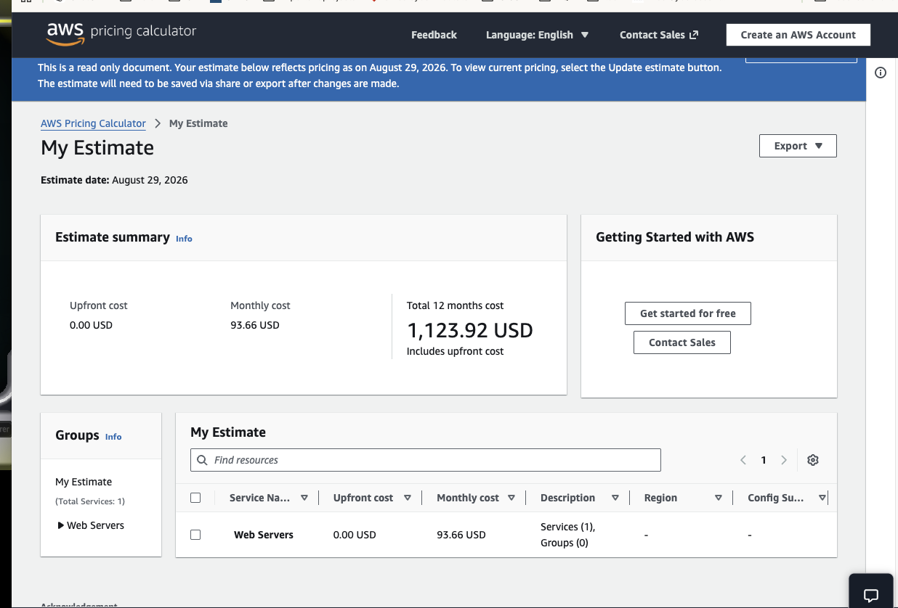

# AWS Cloud Economics and EC2 Cost Estimation

Hands-on AWS Cloud Practitioner / Cloud Quest lab using the **AWS Pricing Calculator** to model an Amazon EC2 workload, organize resources into a logical pricing group, estimate utilization, and review monthly and annual cloud costs.

This project focuses on the financial side of cloud architecture: **right-sizing, workload patterns, usage estimation, and cost visibility**.

## Lab Objective

The lab required us to:

- create a logical pricing group for web servers;
- configure an Amazon EC2 cost estimate;
- model a workload with daily demand spikes;
- review estimated EC2 utilization hours;
- inspect On-Demand compute pricing;
- account for network data transfer;
- review the final monthly and 12-month estimate.

## Cost-Estimation Workflow

```text
Business / Workload Requirement
            |
            v
Define Pricing Group
            |
            v
Choose EC2 Configuration
            |
            v
Model Usage Pattern
            |
            v
Calculate Instance Hours
            |
            v
Add Data Transfer / Other Costs
            |
            v
Review Monthly + Annual Estimate
```

## 1. Created a logical pricing group

We created a group named **Web Servers** in AWS Pricing Calculator.



**Why this matters:** pricing groups make larger estimates easier to understand by organizing services according to application tier, team, environment, or business function.

## 2. Configured the EC2 workload model

The EC2 estimate used:

- Shared Instances
- Linux
- a Daily spike traffic workload pattern
- all seven days of the week



**Why this matters:** real workloads are rarely constant. Modeling usage patterns gives a more realistic cost estimate than assuming peak capacity runs all day.

## 3. Modeled baseline and peak usage

The workload model used:

```text
Baseline count: 2
Peak capacity: 4
Peak duration: 8 hours/day
```



This shows how the calculator converts a daily workload pattern into estimated utilization hours.

### Production relevance

This is closely related to **elasticity** and **Auto Scaling**. Instead of paying for peak capacity 24/7, an elastic design can maintain a baseline and add resources only when demand increases.

## 4. Reviewed the On-Demand compute calculation

The calculator displayed:

```text
On-Demand instance hours: 1946.6666

1946.6666 hours × 0.0416 USD
= 80.981331 USD/month
```



This demonstrates the basic cloud-cost formula:

```text
Cost = Usage × Unit Price
```

## 5. Included data-transfer costs

The estimate also modeled network traffic.

The calculator showed:

```text
Inbound from Internet:
1024 GB/month × 0 USD/GB = 0.00 USD

Outbound to Internet:
100 GB/month × 0.09 USD/GB = 9.00 USD

Monthly data-transfer cost:
9.00 USD
```



**Why this matters:** ingress and egress do not necessarily have the same price. Outbound internet traffic can materially affect cloud cost.

## 6. Reviewed the final estimate

The completed estimate produced:

```text
Upfront cost:       0.00 USD
Monthly cost:      93.66 USD
12-month cost:  1,123.92 USD
```



The screenshots show individual cost components such as On-Demand EC2 compute and data transfer. The total estimate reflects all configured components in the calculator.

# Cloud Economics Concepts Demonstrated

## Pay-as-you-go

Cloud computing allows organizations to pay for resources as they are consumed rather than purchasing all infrastructure upfront.

## Variable Expense vs Capital Expense

Cloud can shift spending from large capital purchases toward usage-based operating expenses.

## Right-Sizing

The goal is to choose enough capacity for the workload without over-provisioning.

```text
Enough capacity
     +
Acceptable performance
     +
Lowest appropriate cost
```

## Elasticity and Cost Optimization

An elastic architecture can increase resources during demand spikes and reduce them afterward, helping align cost with actual usage.

## Pricing Models to Know

| Pricing model | Typical use |
|---|---|
| On-Demand | Flexible workloads with no long-term commitment |
| Savings Plans | Predictable usage with commitment |
| Reserved Instances | Certain predictable workloads |
| Spot Instances | Fault-tolerant and interruption-tolerant workloads |
| Dedicated Hosts / Instances | Isolation or licensing requirements |

## Why AWS Pricing Calculator Is Useful in Production

AWS Pricing Calculator can help teams:

- estimate a project before deployment;
- compare architecture options;
- forecast monthly and annual spend;
- model traffic growth;
- compare EC2 sizes;
- estimate networking costs;
- support budgeting;
- identify optimization opportunities.

## FinOps Perspective

This lab introduces basic FinOps ideas:

- **Visibility** — understand what resources cost.
- **Allocation** — group costs logically around workloads.
- **Optimization** — avoid paying for unnecessary capacity.
- **Forecasting** — estimate future spend.
- **Business value** — connect technical consumption to the service delivered.

## Key AWS Cloud Practitioner Takeaways

- AWS uses pay-as-you-go pricing for many services.
- AWS Pricing Calculator estimates architecture cost before deployment.
- EC2 cost depends on instance type, Region, operating system, usage time, and pricing model.
- Workload patterns can dramatically change monthly cost.
- Auto Scaling can help align capacity with demand.
- Data transfer can add meaningful charges.
- Logical pricing groups help organize complex estimates.
- Cost optimization means matching resources to actual business and technical requirements.

## Screenshots

| Screenshot | Description |
|---|---|
| `01-workload-hours-model.png` | Baseline, peak capacity, daily duration, and calculated workload hours |
| `02-on-demand-compute-calculation.png` | On-Demand EC2 instance-hour pricing calculation |
| `03-ec2-daily-spike-workload.png` | EC2 specifications and daily spike traffic model |
| `04-web-servers-pricing-group.png` | Logical `Web Servers` pricing group |
| `05-final-estimate-summary.png` | Final monthly and 12-month AWS cost estimate |
| `06-data-transfer-calculation.png` | Inbound and outbound network data-transfer pricing |

## Training Context

Completed using AWS Pricing Calculator during an AWS Cloud Quest / AWS Skill Builder exercise for **AWS Certified Cloud Practitioner** preparation.
