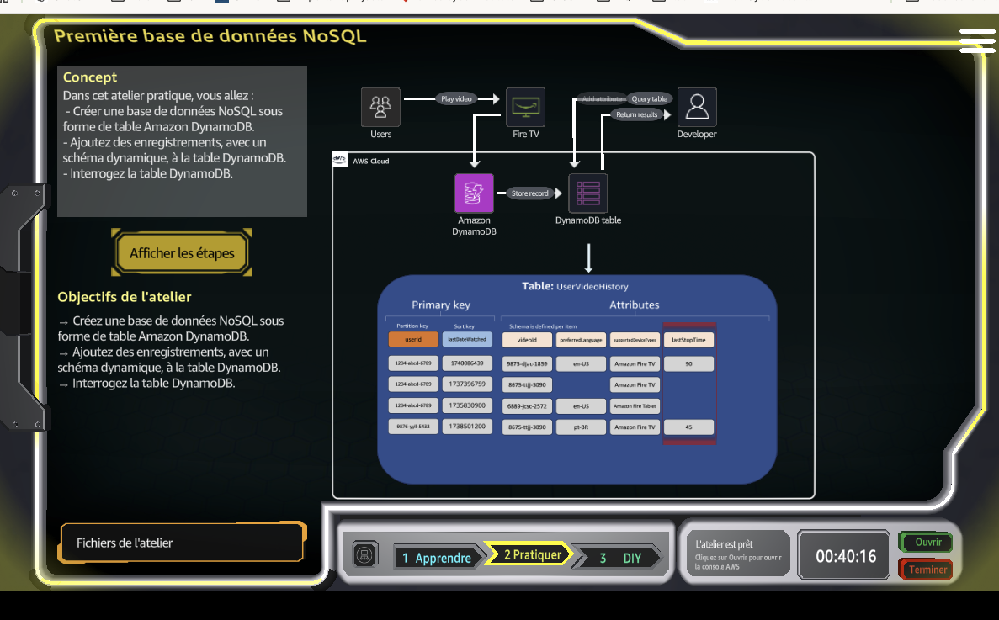
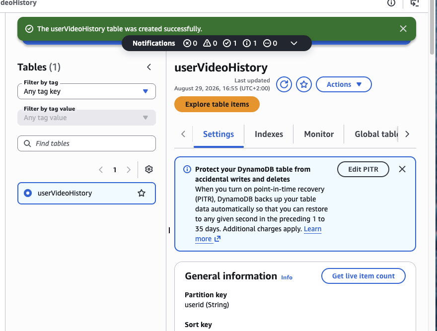
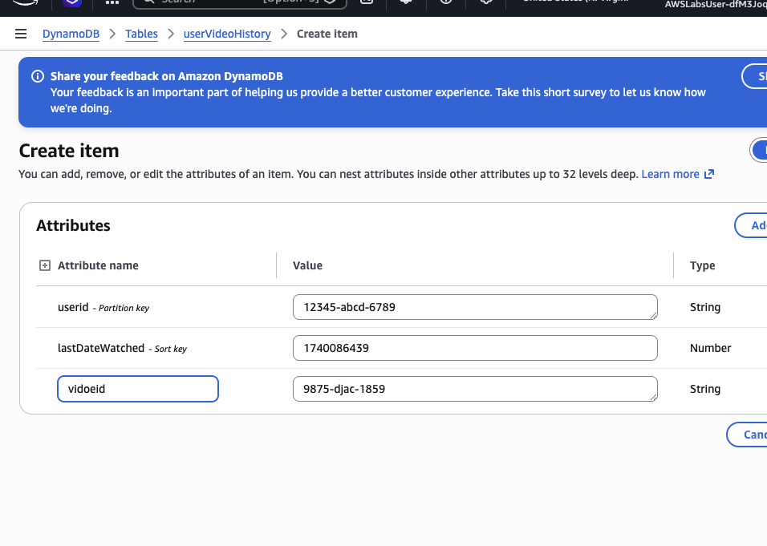
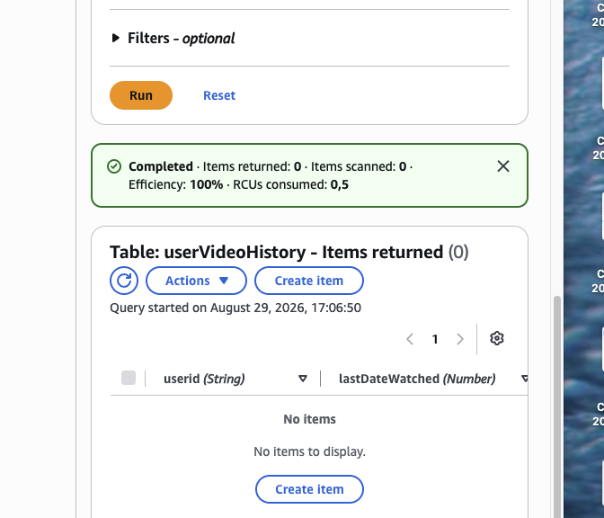
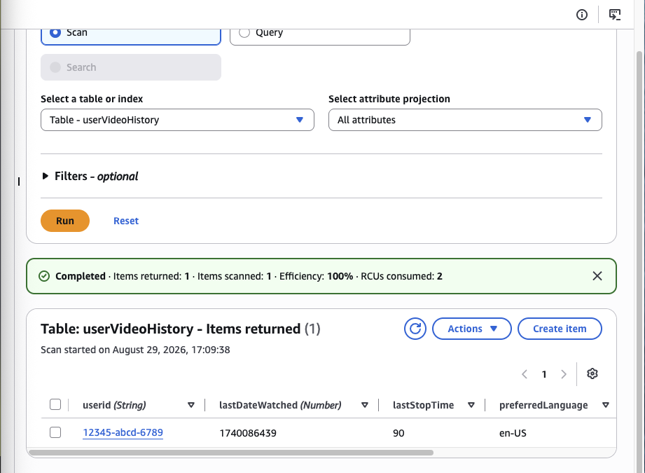
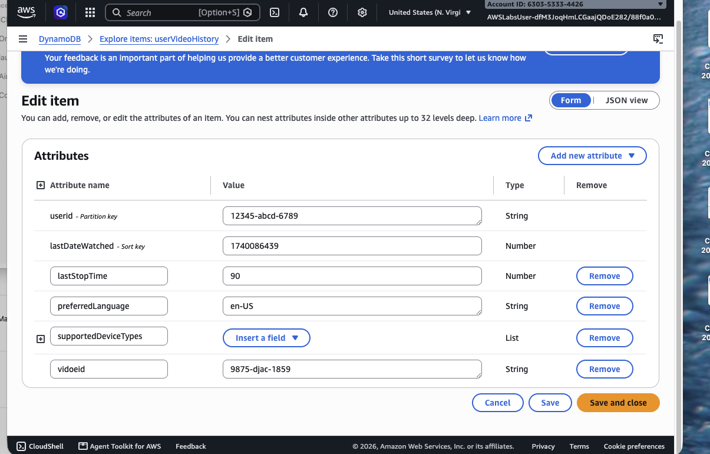

# AWS DynamoDB NoSQL Table Lab – UserVideoHistory

## Overview
In this lab, I worked with **Amazon DynamoDB** to build a simple NoSQL data model for a video history use case. The goal was to create a DynamoDB table, insert an item, explore how **Query** and **Scan** behave, and edit the item by adding more attributes.

This lab is a good hands-on introduction to:
- NoSQL data modeling in AWS
- DynamoDB partition and sort keys
- Creating and editing items
- Understanding the difference between **Query** and **Scan**
- Working with a flexible schema in DynamoDB

---

## Lab Objectives
- Create a NoSQL database using **Amazon DynamoDB**
- Create a table named **`userVideoHistory`**
- Insert an item into the table
- Query and scan the table
- Edit the item and add more attributes

---

## AWS Service Used
- **Amazon DynamoDB**

---

## Scenario
The lab used a sample use case based on a **video history application**. Each record represents a video watched by a user, with attributes such as:
- `userid`
- `lastDateWatched`
- `videoid`
- `lastStopTime`
- `preferredLanguage`
- optional flexible attributes such as supported device information

---

## Step-by-Step Walkthrough

### 1) Lab overview
The lab introduces a DynamoDB-based NoSQL workflow for storing user video history data.



**What this shows:**
- The overall lab concept
- A DynamoDB table named **UserVideoHistory**
- A simple example of how application data can be stored in a NoSQL structure

---

### 2) Create the DynamoDB table
I created the table **`userVideoHistory`** successfully.



**Key configuration:**
- **Table name:** `userVideoHistory`
- **Partition key:** `userid` *(String)*
- **Sort key:** `lastDateWatched` *(Number)*

**Why this matters:**
- The **partition key** groups records by user
- The **sort key** makes it possible to sort or query entries by watch date/time

---

### 3) Create the first item
After creating the table, I created a first item inside it.



**Initial item values used:**
- `userid`: `12345-abcd-6789`
- `lastDateWatched`: `1740086439`
- `videoid`: `9875-djac-1859`

**What I learned here:**
- DynamoDB lets you create items very quickly
- You only need the required keys to create a valid item, and then you can extend it later with more attributes

---

### 4) First query attempt and troubleshooting
I then explored the **Query** function. At first, the query returned **0 items**.



**What happened:**
- I ran a query and received **no results**
- This highlighted an important DynamoDB concept:
  - **Query** looks for items matching specific key conditions
  - **Scan** checks the table more broadly

**Takeaway:**
A query returning zero results does not always mean the table is broken. It often means the search criteria do not match what is stored.

---

### 5) Scan the table and confirm the item exists
I then used **Scan** and successfully returned **1 item** from the table.



**Returned item fields shown:**
- `userid`: `12345-abcd-6789`
- `lastDateWatched`: `1740086439`
- `lastStopTime`: `90`
- `preferredLanguage`: `en-US`

**Why this step is useful:**
- It confirmed the table was populated correctly
- It helped verify the data visually in the DynamoDB console
- It reinforced the difference between **Scan** and **Query**

---

### 6) Edit the item and extend the schema
Finally, I edited the item and added more attributes.



**Attributes visible during editing:**
- `userid` *(Partition key)*
- `lastDateWatched` *(Sort key)*
- `lastStopTime`: `90`
- `preferredLanguage`: `en-US`
- `videoid`: `9875-djac-1859`
- `supportedDeviceTypes` *(prepared as a list-type flexible attribute)*

**Main lesson:**
DynamoDB supports a **flexible schema**, so items in the same table can evolve over time without requiring a rigid relational structure.

---

## Key Concepts Learned
### DynamoDB primary keys
- **Partition key** identifies the logical grouping of records
- **Sort key** allows ordered access within the same partition

### Query vs Scan
- **Query** = efficient lookup using keys
- **Scan** = broader read across table items

### Flexible schema
- DynamoDB is schema-flexible beyond the primary key attributes
- You can add extra attributes to items without redesigning the entire table

---

## Skills Demonstrated
- DynamoDB table creation
- NoSQL table design
- Item creation and modification
- Query troubleshooting
- Table scanning and result validation
- Understanding schema flexibility in AWS

---

## Repository Structure
```bash
aws-dynamodb-nosql-uservideohistory-lab/
├── README.md
└── screenshots/
    ├── 01-lab-overview.png
    ├── 02-table-created.png
    ├── 03-create-item.png
    ├── 04-query-returned-no-items.png
    ├── 05-scan-returned-item.png
    └── 06-edit-item-attributes.png
```

---

## Conclusion
This lab provided a practical introduction to **Amazon DynamoDB** and NoSQL concepts in AWS. I created a table, inserted data, explored how to retrieve it, and updated the item with additional attributes. The most valuable part was understanding the difference between **Query** and **Scan**, and seeing how DynamoDB supports a flexible schema for evolving application data.
