# AWS EC2 Auto Scaling and Self-Healing Lab

This lab documents how to build a basic **Amazon EC2 Auto Scaling** environment for a game server workload. Starting from an existing EC2 instance, I created an **AMI**, built a **launch template**, created an **Auto Scaling group** across multiple Availability Zones, configured **dynamic scaling** based on CPU usage, and added a **scheduled scaling action**.

## Lab Goals

- Create an AMI from an existing EC2 game server instance
- Create a launch template from that server configuration
- Build an Auto Scaling group across multiple subnets / Availability Zones
- Configure a target tracking scaling policy
- Add a scheduled action for predictable demand
- Verify the automatically created CloudWatch alarms

## Services Used

- Amazon EC2
- Amazon Machine Images (AMI)
- EC2 Launch Templates
- Amazon EC2 Auto Scaling
- Amazon CloudWatch

## Architecture Overview

The lab scenario uses a game server pattern where Amazon EC2 Auto Scaling can launch or remove instances automatically depending on demand.

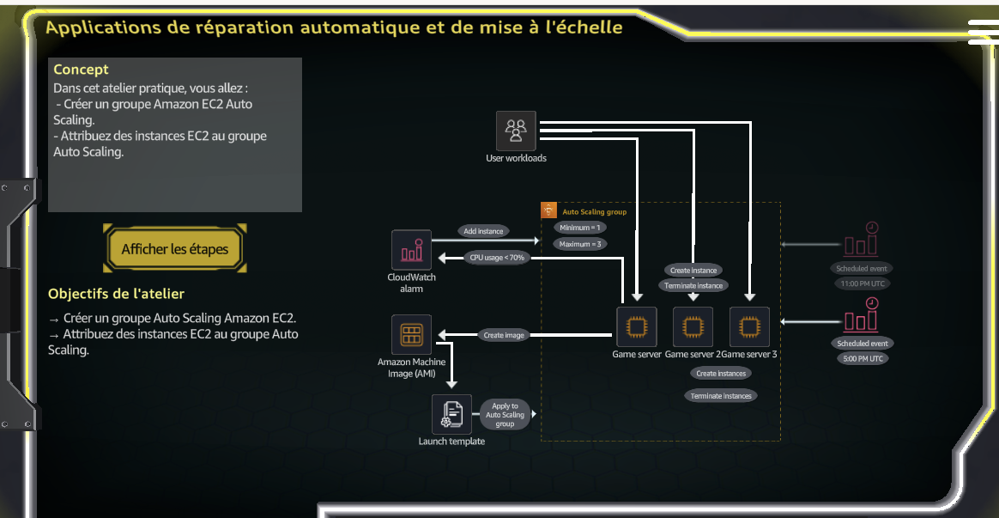

## What I Built

### 1) Created an AMI from the existing Game Server instance

The first step was to create an image from the existing **Game Server** EC2 instance. This AMI becomes the reusable golden image used by the launch template and Auto Scaling group.

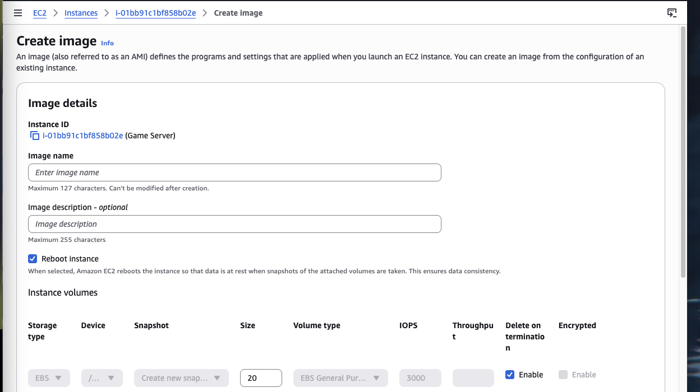

After submitting the request, AWS started creating the AMI in the background.

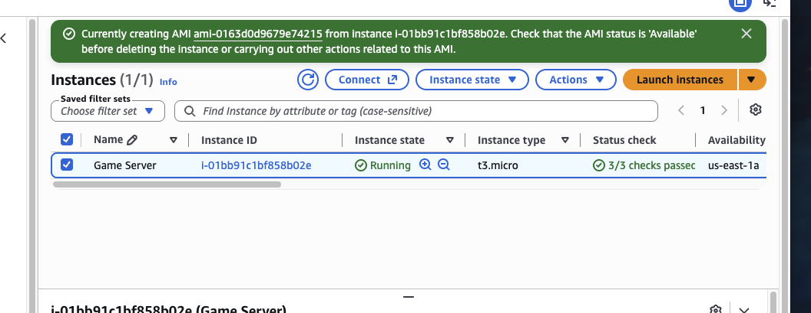

> Note: AMI creation can stay in **Pending** state for several minutes. Refresh the page and wait until the AMI becomes **Available** before using it in downstream resources.

### 2) Created the EC2 launch template

After the AMI was ready, I created the **GameServerTemplate** launch template. This template stores the instance settings that Auto Scaling will use when launching new EC2 instances.

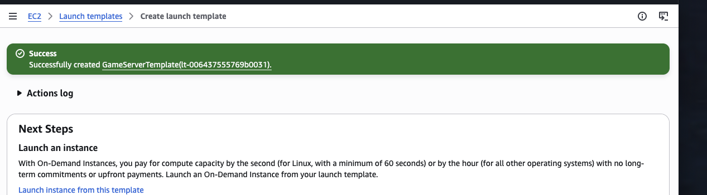

## 3) Created the Auto Scaling group

I then created an Auto Scaling group named **RegularCustomerGameServer** and selected the **GameServerTemplate** launch template.

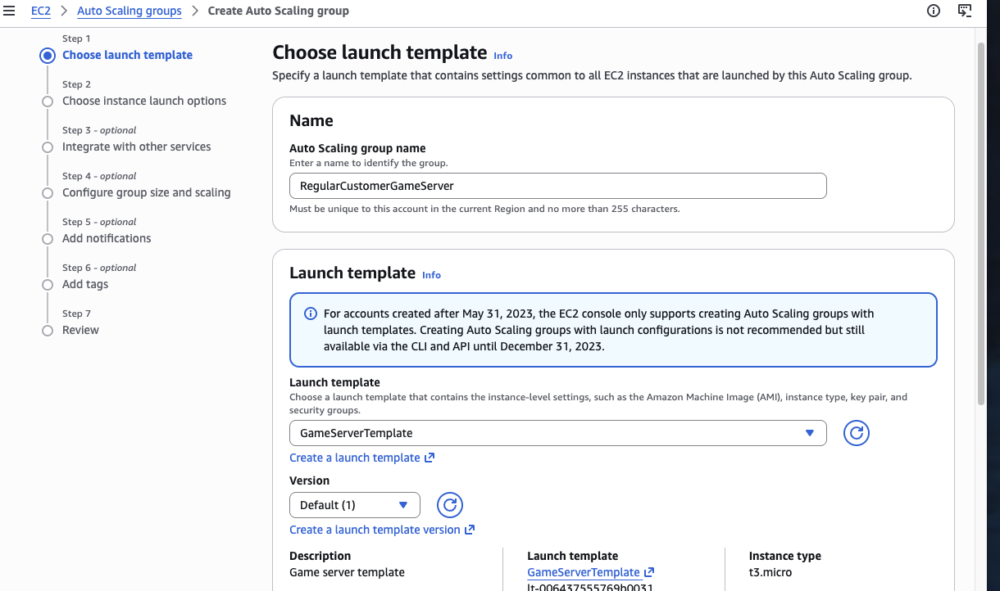

On the review page, AWS confirmed the selected launch template, the target VPC, and the two subnets spanning **us-east-1a** and **us-east-1b**.

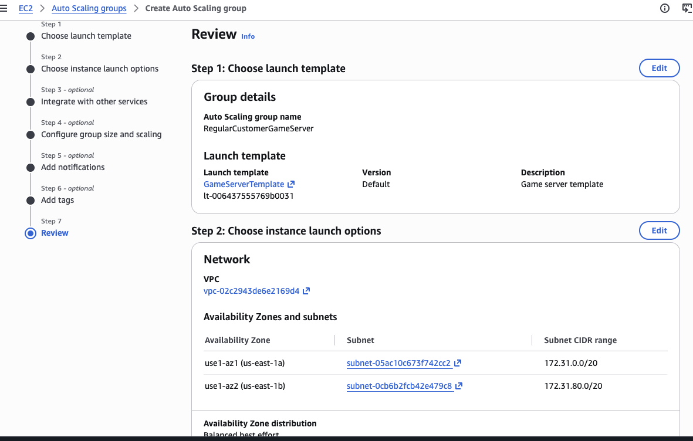

Once created, the Auto Scaling group appeared in the console and started **Updating capacity**.

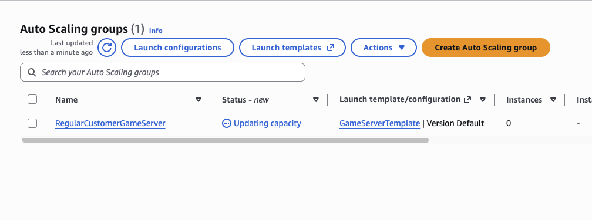

### Key Auto Scaling group details

- **Auto Scaling group name:** `RegularCustomerGameServer`
- **Launch template:** `GameServerTemplate`
- **Availability Zones / subnets:** `us-east-1a` and `us-east-1b`
- **Scaling limits shown later in the lab:** `2 - 4`

## 4) Configured dynamic scaling

To make the environment react automatically to load, I created a **Target tracking scaling policy**.

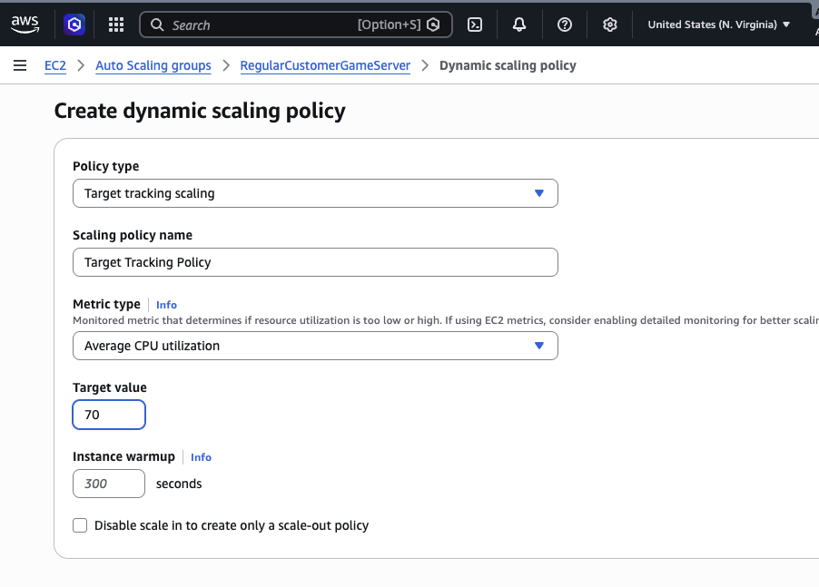

### Dynamic scaling policy settings

- **Policy type:** Target tracking scaling
- **Metric type:** Average CPU utilization
- **Target value:** `70`
- **Instance warmup:** `300 seconds`

This means Auto Scaling tries to maintain average CPU usage around **70%** by launching or terminating instances as needed.

## 5) Added a scheduled scaling action

In addition to dynamic scaling, I added a scheduled action for predictable workload increases.

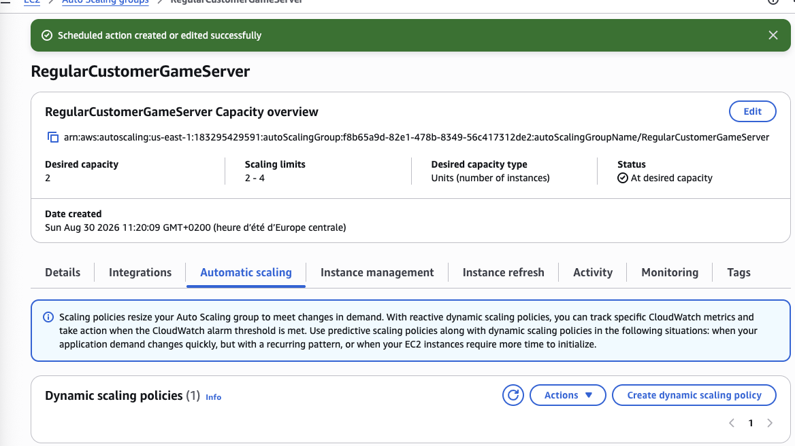

From the Auto Scaling group overview visible in the console, the environment reached:

- **Desired capacity:** `2`
- **Scaling limits:** `2 - 4`
- **Status:** `At desired capacity`

A scheduled action is useful when you already know traffic will increase at specific times, such as regular weekly gaming peaks.

## 6) Verified CloudWatch alarms

When the target tracking policy was created, AWS automatically created CloudWatch alarms.

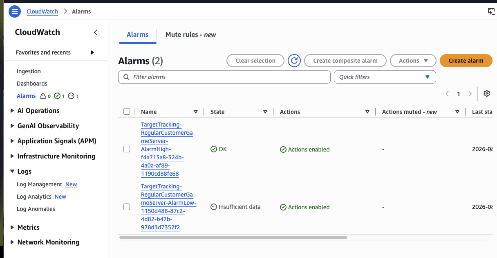

Opening the high alarm shows the **CPUUtilization** threshold used by the scaling policy.

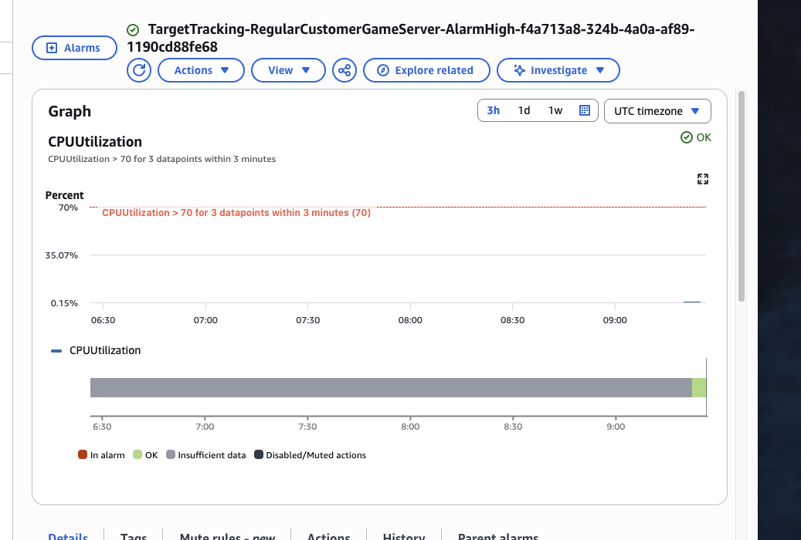

This confirms that CloudWatch is linked to the Auto Scaling policy and will help drive scale-out / scale-in actions.

## Troubleshooting Notes

### AMI stayed in Pending

This is normal for a short time while AWS creates the image.

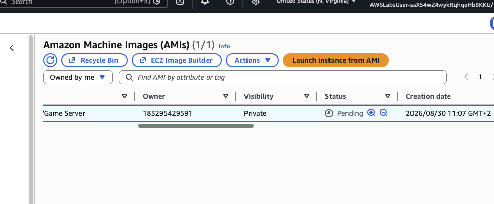

**Fix / lesson learned:** wait a few minutes and refresh until the AMI status changes to **Available**.

### Auto Scaling group creation failed because of VPC / security group mismatch

At one point, Auto Scaling could not be created because the security groups in the launch template were not linked to the same VPC as the Auto Scaling group.

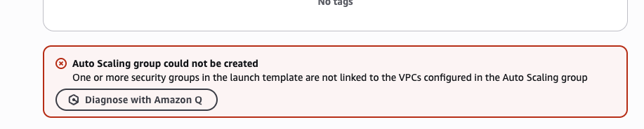

**Fix / lesson learned:** make sure the **launch template security group** belongs to the **same VPC** as the subnets selected for the Auto Scaling group.

### Scheduled action failed because the start date was in the past

Another issue happened when creating a scheduled action using a past date.

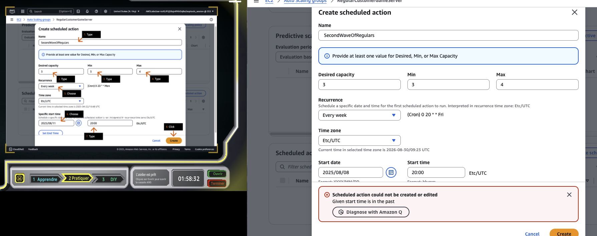

**Fix / lesson learned:** choose a **future date and time** for the first scheduled run.

## Outcome

By the end of this lab, I successfully:

- Created an AMI from an EC2 instance
- Built a launch template
- Created an EC2 Auto Scaling group across multiple Availability Zones
- Configured a target tracking policy based on CPU utilization
- Added a scheduled scaling action
- Verified the CloudWatch alarms attached to the scaling policy
- Troubleshot common setup issues during the build

## Repository Structure

```text
aws-ec2-auto-scaling-game-server-lab/
├── README.md
└── screenshots/
    ├── 01-lab-architecture.png
    ├── 02-create-image-from-instance.png
    ├── 03-ami-creation-in-progress.png
    ├── 04-launch-template-created.png
    ├── 05-choose-launch-template.png
    ├── 06-auto-scaling-group-review.png
    ├── 07-auto-scaling-group-created.png
    ├── 08-dynamic-scaling-policy.png
    ├── 09-scheduled-action-created.png
    ├── 10-cloudwatch-alarms-list.png
    ├── 11-cloudwatch-alarm-details.png
    ├── 12-troubleshooting-ami-pending.png
    ├── 13-troubleshooting-vpc-security-group-mismatch.png
    └── 14-troubleshooting-scheduled-action-past-date.png
```

## Skills Demonstrated

- EC2 image creation
- Launch template creation
- Auto Scaling group deployment
- Scaling policy design
- Scheduled scaling
- CloudWatch integration
- AWS troubleshooting and validation

