# AWS EFS Shared File System Multi-AZ Lab

## Overview

This lab demonstrates how to build a **shared Linux file system in AWS with Amazon Elastic File System (Amazon EFS)** and mount it from multiple Amazon EC2 instances.

The main objective was to create a **regional EFS file system**, expose it to EC2 instances through **mount targets in multiple Availability Zones**, control access with a dedicated **NFS security group**, mount the file system using **amazon-efs-utils with TLS**, and verify that two EC2 instances could read and write the **same shared log file**.

This is a practical example of the difference between local/block storage and a managed network file system: multiple servers can access the same EFS data simultaneously.

---

## AWS Services and Concepts

- **Amazon Elastic File System (EFS)**
- **Amazon EC2**
- **Amazon VPC**
- **Security Groups**
- **NFS**
- **EFS mount targets**
- **Availability Zones**
- **AWS Systems Manager Session Manager**
- **Encryption at rest**
- **Encryption in transit with TLS**
- **Shared storage / high availability**

---

## Architecture

The lab architecture contains multiple EC2 web servers in different Availability Zones and an Amazon EFS regional file system. Each Availability Zone reaches EFS through a local **mount target**.

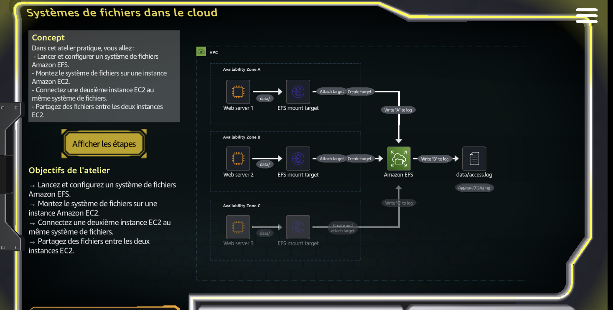

The key idea is:

```text
EC2 WebServer1 (AZ A) ---- EFS mount target ----┐
                                                │
EC2 WebServer2 (AZ B) ---- EFS mount target ----┼---- Amazon EFS
                                                │       shared data
EC2 WebServer3 (AZ C) ---- possible target -----┘
```

In the hands-on validation shown in this repository, the shared file was verified between **site A and site B**.

---

## 1. Existing EC2 Web Servers

The lab environment contained three running EC2 instances: `WebServer1`, `WebServer2`, and `WebServer3`.

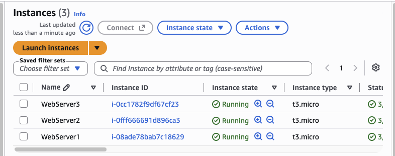

These instances represent application servers that may need to consume the same shared files instead of maintaining separate local copies.

### Why this matters

A shared filesystem is useful when multiple compute instances need access to common content such as:

- application assets
- configuration data
- user-uploaded files
- shared web content
- logs
- machine-learning datasets

---

## 2. Dedicated EFS Security Group

A dedicated security group named **`PetModels-EFS-1-SG`** was created for the EFS environment.

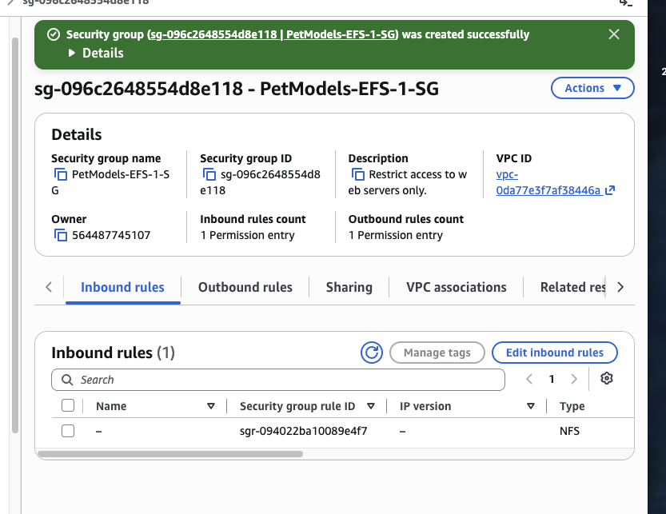

The inbound rule is of type **NFS**. EFS uses the NFS protocol for Linux clients.

### Security principle

The EFS security group should only allow NFS traffic from the EC2 instances that need to mount the filesystem, rather than exposing NFS broadly.

This follows the principle of **least privilege**.

---

## 3. Create a Regional Amazon EFS File System

The file system was created as **`PetModels-EFS-1`** with the **Regional** file system type.

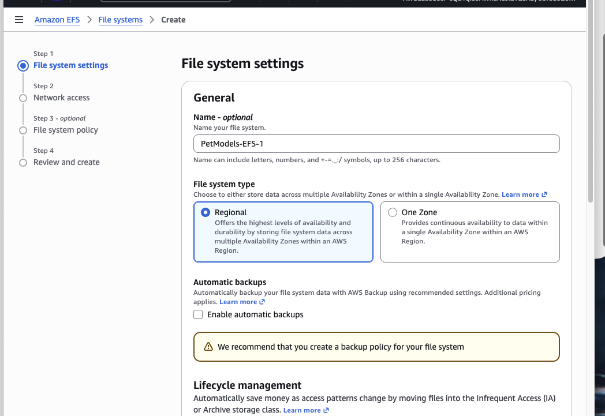

### Configuration visible in the lab

- **Name:** `PetModels-EFS-1`
- **File system type:** Regional
- **Automatic backups:** disabled for this lab
- Regional storage was selected to provide availability across multiple Availability Zones.

### Why Regional EFS?

Regional EFS is designed to store data redundantly across multiple Availability Zones in an AWS Region. This makes it appropriate for workloads where the shared filesystem should not depend on a single AZ.

---

## 4. Review the EFS Configuration

Before creation, AWS displayed the complete configuration for review.

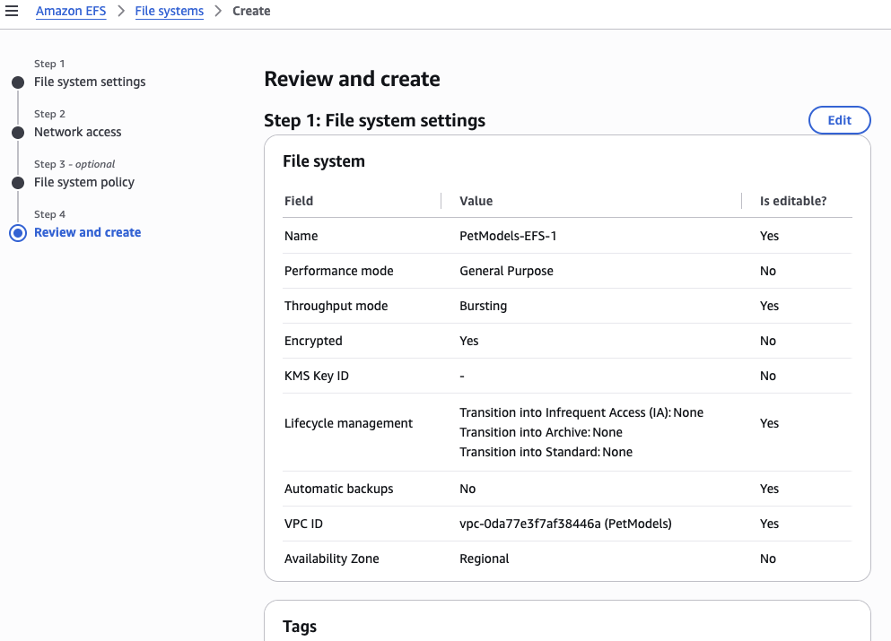

The review page confirms important settings such as:

- **Performance mode:** General Purpose
- **Throughput mode:** Bursting
- **Encryption:** enabled
- **Availability:** Regional
- **VPC:** the lab VPC

This is an important step because the EFS networking configuration must match the VPC used by the EC2 clients.

---

## 5. EFS File System Successfully Created

The EFS console confirmed that **`PetModels-EFS-1`** was successfully created and available.

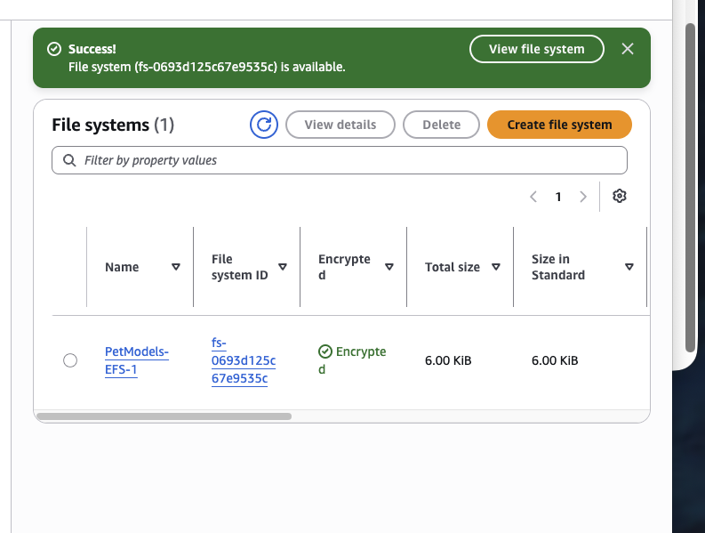

At this point, the filesystem existed, but EC2 connectivity still depended on its **mount targets and security groups**.

---

## 6. Multi-AZ Mount Targets

The EFS network configuration shows mount targets in two Availability Zones:

- `us-east-1a`
- `us-east-1b`

Both mount targets reached the **Available** state.

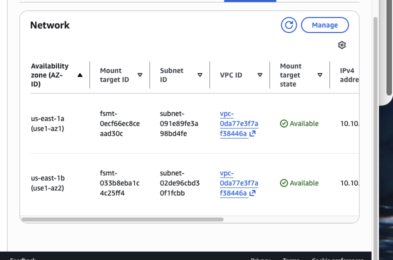

### What is an EFS mount target?

A mount target is a network endpoint created inside a subnet. EC2 clients use it to communicate with EFS over the VPC network.

A common production design is to create an EFS mount target in each Availability Zone from which clients will access the filesystem.

---

## 7. Install the EFS Client Utilities

On the EC2 instances, the Amazon EFS client package was installed with:

```bash
sudo yum install -y amazon-efs-utils
```

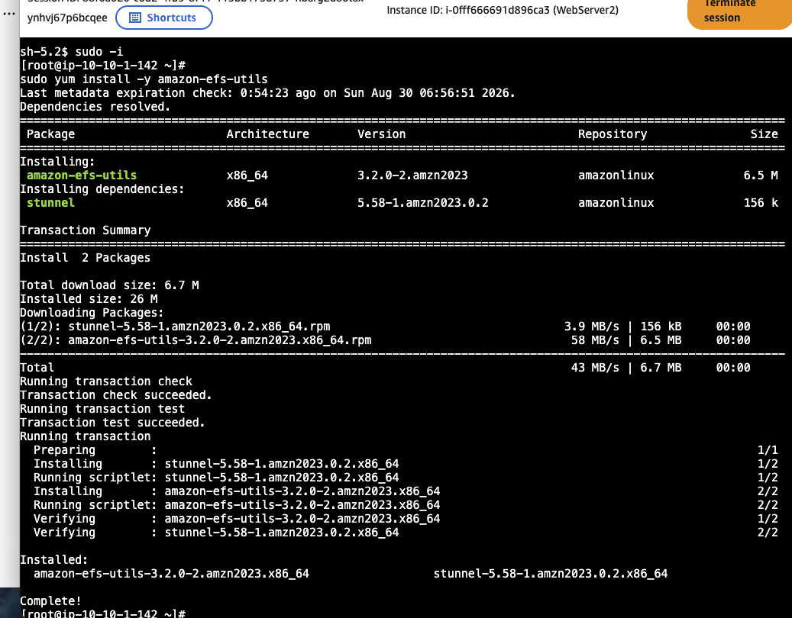

The package provides the EFS mount helper and supports features such as encrypted mounts.

The terminal session was accessed through AWS-managed browser connectivity in the lab, avoiding the need to rely on a permanently exposed SSH service.

---

## 8. Mount EFS with TLS and Write Shared Data

A local mount directory was created and the EFS filesystem was mounted with TLS.

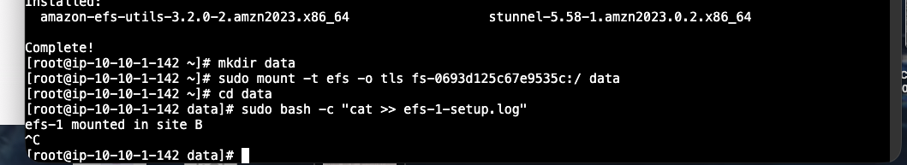

Commands used in the lab included:

```bash
mkdir data
sudo mount -t efs -o tls fs-0693d125c67e9535c:/ data
cd data
```

The `-o tls` option encrypts traffic between the EC2 client and Amazon EFS while data is in transit.

A shared file named `efs-1-setup.log` was then used to record entries from different sites.

---

## 9. Verify Cross-Instance File Sharing

The strongest validation in the lab was reading the same file and seeing entries written from different EC2 sites:

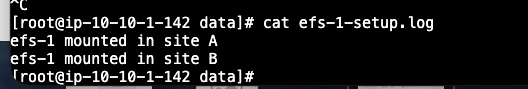

The file contained:

```text
efs-1 mounted in site A
efs-1 mounted in site B
```

This proves that the EC2 instances were not writing to isolated local disks. They were accessing the **same shared EFS filesystem**.

### What this demonstrates

```text
WebServer1 ---- write ----┐
                          ├---- /data/efs-1-setup.log on Amazon EFS
WebServer2 ---- write ----┘
```

Both instances can access the same file over the network.

---

## 10. EFS Storage Usage

The EFS console showed a metered size of **6.00 KiB** in the Standard storage class during the lab.

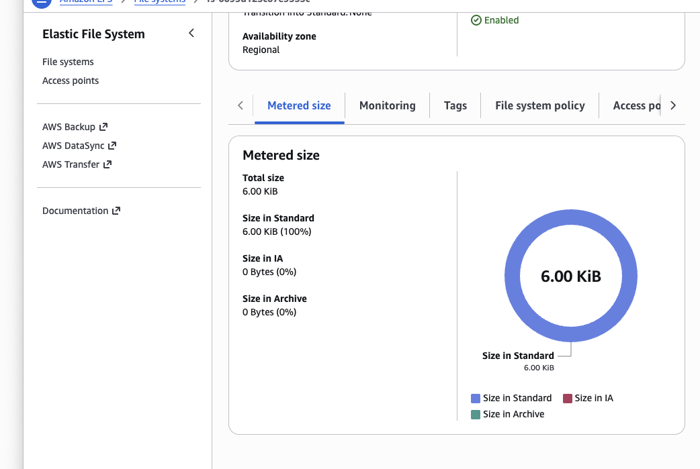

EFS automatically scales storage capacity as data is added or removed, so administrators do not pre-provision a fixed disk size as they normally would with many block-storage systems.

---

# EFS vs EBS vs S3

| Service | Storage type | Typical access model | Good use case |
|---|---|---|---|
| **Amazon EFS** | Network file storage | Multiple Linux instances can mount the same filesystem | Shared application files, web fleets, shared datasets |
| **Amazon EBS** | Block storage | Normally attached as a disk to EC2 | OS volumes, databases, low-latency block workloads |
| **Amazon S3** | Object storage | Access through API/HTTP rather than mounting as a traditional filesystem | Backups, static assets, data lakes, archives |

---

## Security Takeaways

### Network access
EFS access is controlled through VPC networking and security groups. NFS access should be restricted to trusted application instances.

### Encryption at rest
The EFS configuration in this lab shows the filesystem as encrypted.

### Encryption in transit
The filesystem was mounted with:

```bash
-o tls
```

which protects NFS traffic between EC2 and EFS in transit.

### Administration access
Using AWS-managed session connectivity reduces the need to expose SSH directly to the internet.

---

## High-Availability Takeaways

The main architectural benefit of this lab is that compute and storage are decoupled.

If one EC2 instance is replaced, the shared data remains on EFS. Likewise, mount targets in multiple Availability Zones allow application servers in more than one AZ to reach the shared filesystem.

EFS therefore fits architectures that combine:

- horizontally scaled EC2 fleets
- Auto Scaling Groups
- multi-AZ application tiers
- shared web content
- resilient Linux workloads

---

## Troubleshooting Lessons

During an EFS deployment, common areas to verify are:

1. The EC2 instance and EFS mount target are in compatible VPC networking.
2. A mount target exists in the Availability Zone used by the client.
3. The EFS security group allows NFS traffic from the EC2 clients.
4. `amazon-efs-utils` is installed.
5. The file system ID is correct.
6. The mount directory exists.
7. DNS/network connectivity to the EFS endpoint is working.

---

## Commands

A reusable example is included in:

```text
commands/efs-mount-commands.sh
```

The file system ID in the script is intentionally a placeholder so the example can be reused in another AWS environment.

---

## Repository Structure

```text
aws-efs-shared-filesystem-multi-az-lab/
├── README.md
├── commands/
│   └── efs-mount-commands.sh
└── screenshots/
    ├── 01-lab-architecture.png
    ├── 02-ec2-web-servers.png
    ├── 03-efs-security-group.png
    ├── 04-efs-file-system-settings.png
    ├── 05-efs-review-and-create.png
    ├── 06-efs-file-system-available.png
    ├── 07-mount-targets-multi-az.png
    ├── 08-install-efs-utils.png
    ├── 09-mount-efs-and-write-log.png
    ├── 10-shared-log-validation.png
    └── 11-efs-metered-size.png
```

---

## What I Learned

By completing this lab, I practiced how to:

- create an Amazon EFS regional filesystem
- design EFS network access across Availability Zones
- configure an NFS security group
- install `amazon-efs-utils` on Amazon Linux
- mount EFS securely using TLS
- share the same files between EC2 instances
- validate shared writes from multiple application servers
- distinguish EFS from EBS and S3
- understand why shared network storage is useful in highly available cloud architectures

---

## Conclusion

This lab demonstrated a real cloud architecture pattern: **multiple EC2 instances using the same managed shared filesystem**.

Amazon EFS removes the need to provision and manage a traditional NFS server, scales storage automatically, integrates with VPC networking, and can provide shared storage to application servers across multiple Availability Zones.

The final shared `efs-1-setup.log` test was the key proof that the two EC2 sites were reading and writing to the same EFS data.
