# AWS High Availability Web Application Lab

## Overview
This lab demonstrates how to build a more highly available web application on AWS using an **Application Load Balancer**, **Target Groups**, **Amazon EC2 Auto Scaling**, **Security Groups**, and multiple Availability Zones.

The exercise focused on connecting an existing Auto Scaling group to a load balancer, validating instance health, and confirming that the Auto Scaling group could launch and manage EC2 instances automatically.

## Architecture
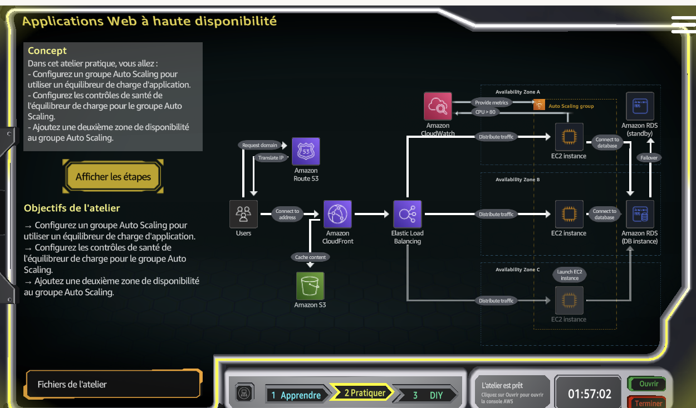

The architecture distributes incoming web traffic through an Application Load Balancer before forwarding requests to EC2 instances managed by an Auto Scaling group.

## Services Used
- Amazon EC2
- Amazon EC2 Auto Scaling
- Elastic Load Balancing
- Application Load Balancer
- Target Groups
- Security Groups

## 1. Create the Target Group
I created an instance target group for the web tier.

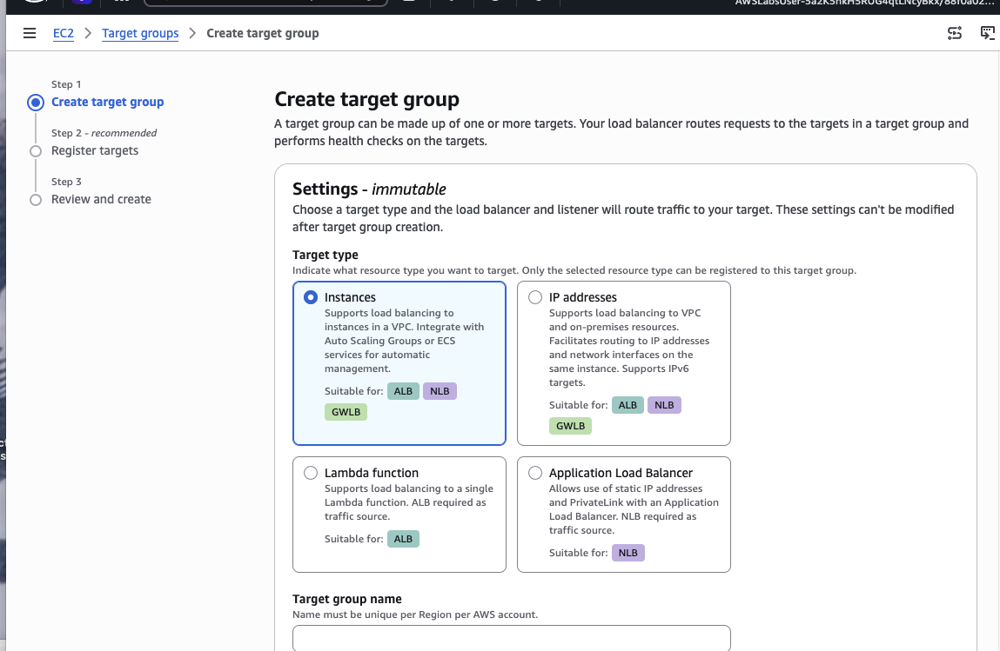

The target group was created successfully and configured for HTTP traffic on port 80.

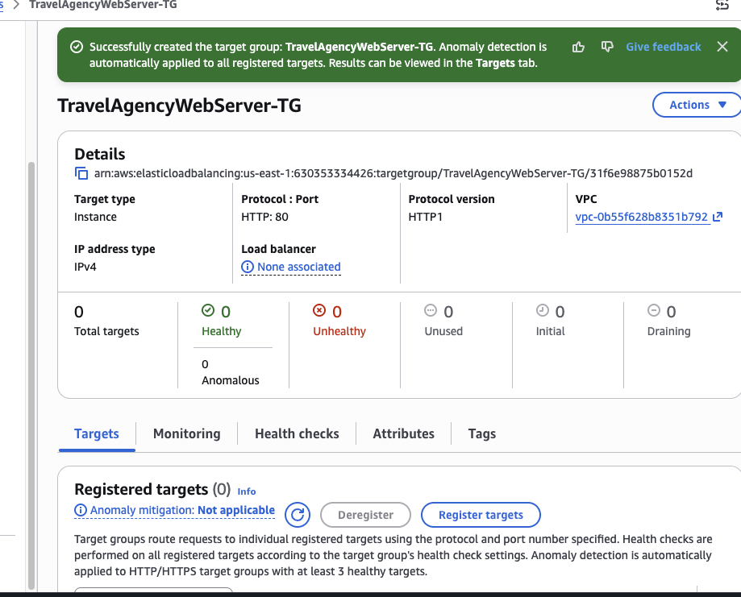

The target group acts as the destination for traffic forwarded by the Application Load Balancer and provides health checking for registered EC2 targets.

## 2. Configure Security Groups
The environment uses separate security groups for the load balancer and the web servers.

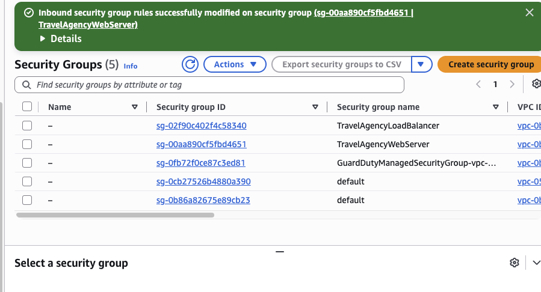

This allows a cleaner traffic flow:

```text
Internet
   |
   | HTTP 80
   v
Application Load Balancer
   |
   | HTTP 80
   v
Web Server Security Group
   |
   v
EC2 instances
```

This separation reduces direct exposure of the EC2 instances.

## 3. Create the Application Load Balancer
The Application Load Balancer was created successfully.

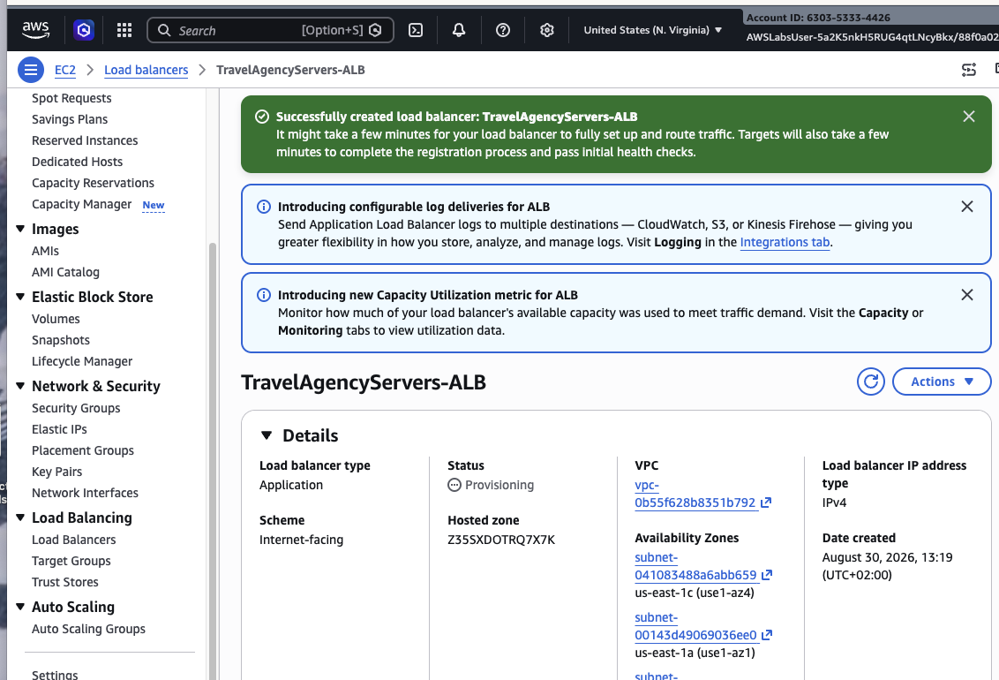

After provisioning, the ALB reached the **Active** state and exposed an AWS DNS name.

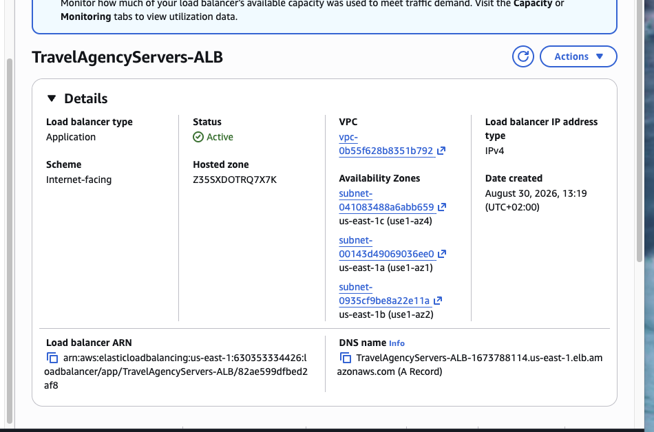

The ALB spans multiple Availability Zones, allowing traffic to be distributed across a more resilient infrastructure.

## 4. Attach the Target Group to the Auto Scaling Group
The `TravelAgencyWebServer-TG` target group was attached to the existing `TravelAgencyWebServers` Auto Scaling group.

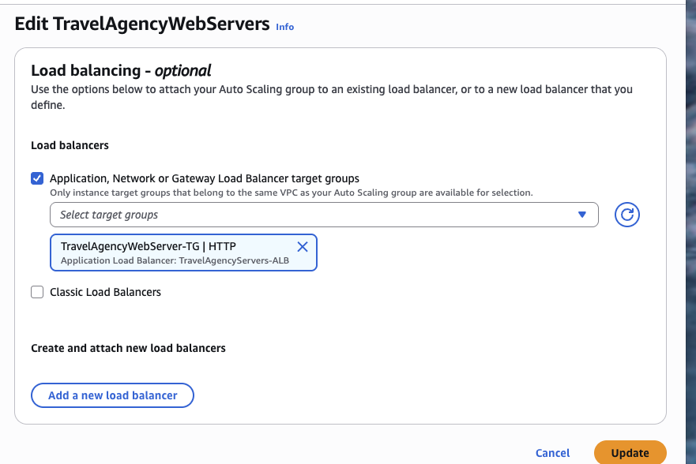

The Auto Scaling group integration page confirmed that the target group was attached successfully.

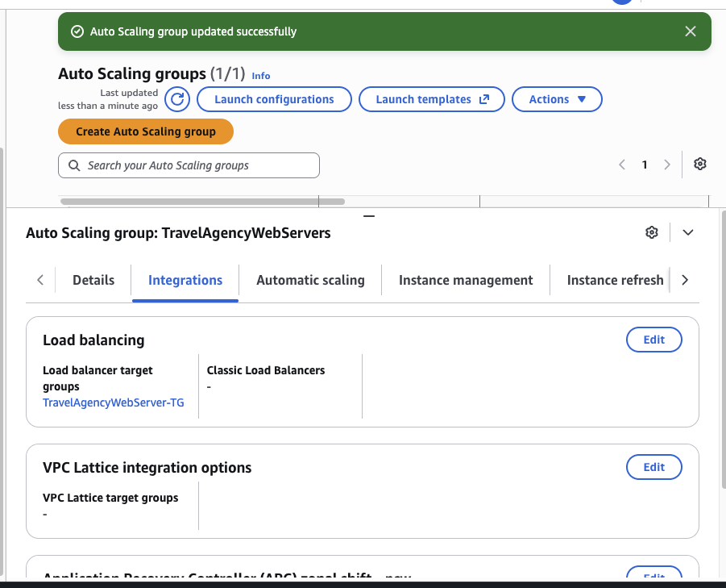

This allows instances launched by the Auto Scaling group to be automatically registered with the load balancer target group.

## 5. Verify Desired Capacity
The Auto Scaling group reached its expected state and showed **At desired capacity**.

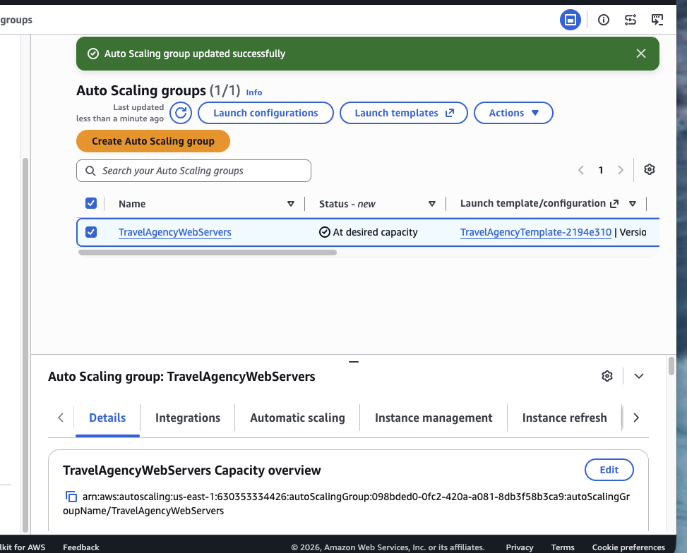

This confirms that Auto Scaling was maintaining the configured number of EC2 instances.

## 6. Review Auto Scaling Activity
The activity history showed successful Auto Scaling actions, including attaching the load balancer target group and launching new EC2 instances.

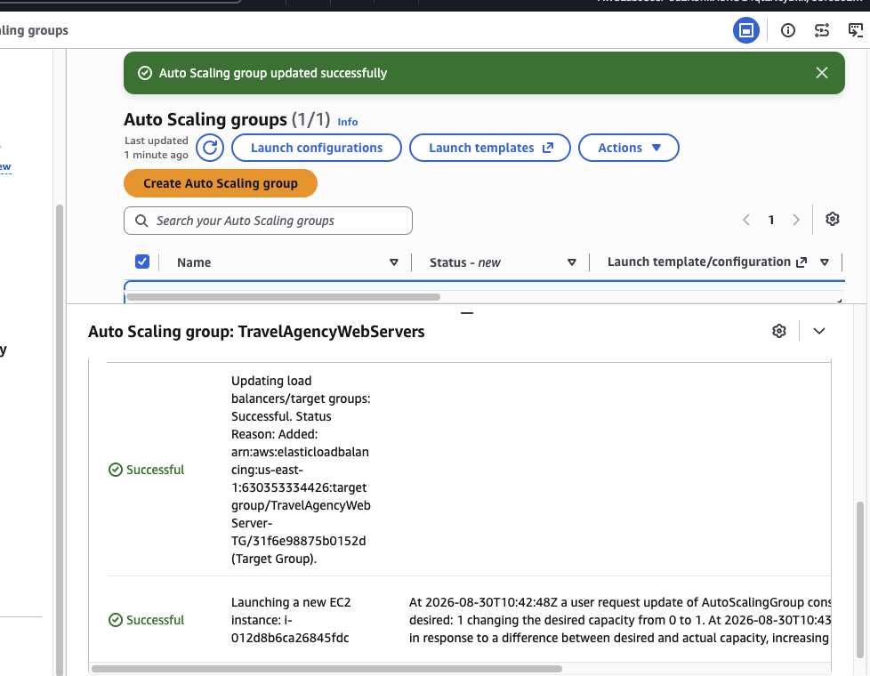

Additional activity showed the Auto Scaling group increasing capacity and launching another EC2 instance.

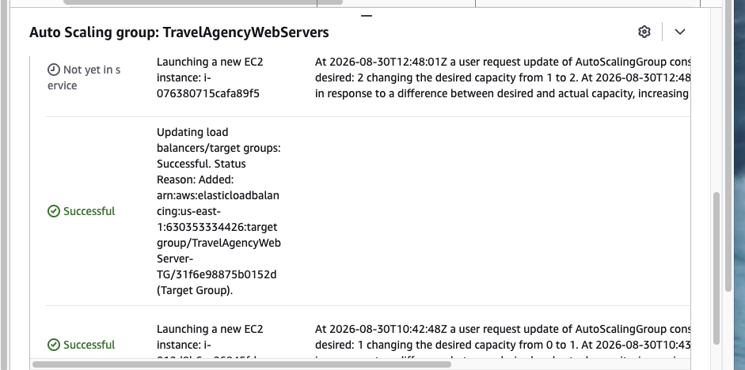

This demonstrates how the group can react to a difference between desired and actual capacity and launch replacement or additional instances automatically.

## Key Concepts Learned

### Application Load Balancer
An ALB distributes HTTP/HTTPS requests across healthy targets.

### Target Groups
Target groups contain the backend EC2 instances that receive traffic from the load balancer.

### Health Checks
The load balancer checks target health and sends traffic only to healthy instances.

### Auto Scaling
The Auto Scaling group maintains the desired number of instances and can launch new instances when capacity changes.

### High Availability
Using multiple Availability Zones reduces the impact of a single-AZ failure.

### Security Group Separation
Using one security group for the ALB and another for the web tier is a common production pattern that limits direct access to backend instances.

## Production Relevance
This architecture is commonly used for:
- public web applications
- e-commerce platforms
- API backends
- SaaS applications
- highly available customer portals

A production architecture would typically add HTTPS with ACM certificates, Route 53 DNS, centralized logging, CloudWatch alarms, WAF, and a highly available database layer.

## Repository Structure
```text
aws-high-availability-web-app-alb-autoscaling-lab/
├── README.md
└── screenshots/
    ├── 01-lab-architecture.png
    ├── 02-create-target-group.png
    ├── 03-target-group-created.png
    ├── 04-security-groups.png
    ├── 05-load-balancer-created.png
    ├── 06-load-balancer-active.png
    ├── 07-attach-target-group-to-asg.png
    ├── 08-asg-integration.png
    ├── 09-asg-at-desired-capacity.png
    ├── 10-asg-activity-history.png
    └── 11-asg-scaling-activity.png
```

## AWS Cloud Practitioner Takeaways
- Elastic Load Balancing distributes traffic across healthy targets.
- Auto Scaling helps maintain application availability and capacity.
- Target groups connect load balancers to backend resources.
- Multi-AZ designs improve resilience.
- Security groups act as stateful virtual firewalls.
- Auto Scaling and load balancing are core building blocks for highly available applications on AWS.

## Conclusion
This lab combined several AWS services to build a more resilient web application architecture. I created the target group and Application Load Balancer, configured security-group separation, attached the load balancer to the Auto Scaling group, and verified that EC2 capacity was managed automatically.
