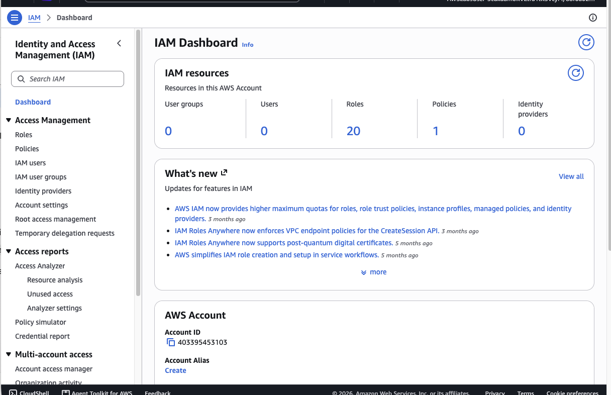
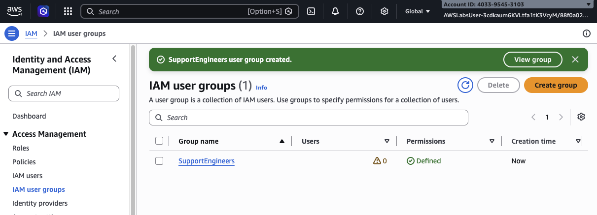
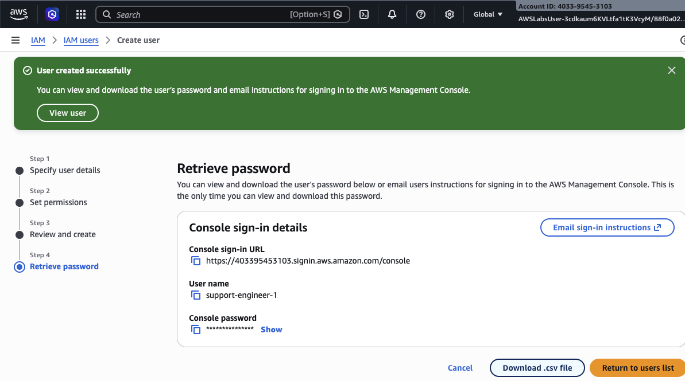
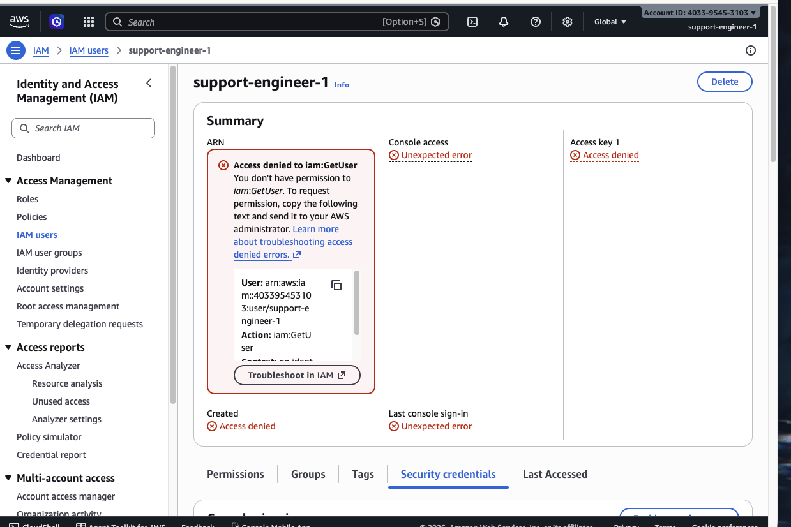
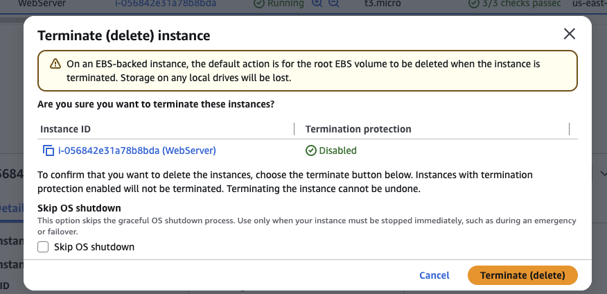
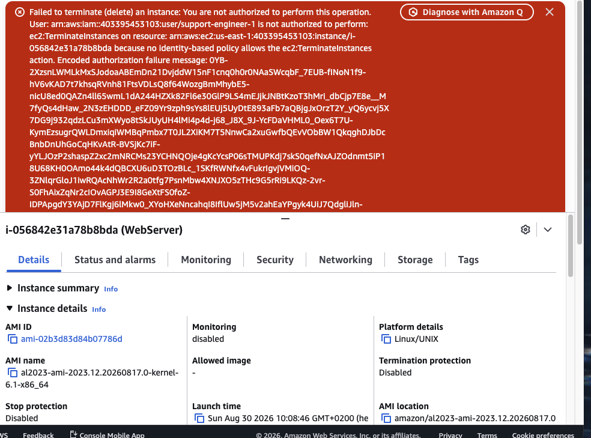

# AWS IAM Users, Groups & Managed Policies Lab

## Overview

This hands-on AWS lab demonstrates the fundamentals of **Identity and Access Management (IAM)** using a support-engineer scenario.

The goal was to create an IAM user group, create a support user, assign permissions through the group, sign in as that restricted user, and then validate the difference between **allowed read-only operations** and **denied destructive operations**.

The lab is a practical example of the AWS security principle of **least privilege**.

---

## Lab Objectives

- Explore the AWS IAM console
- Create an IAM user group named `SupportEngineers`
- Create an IAM user named `support-engineer-1`
- Grant permissions through an IAM group rather than directly to the user
- Use AWS-managed read-only permissions for the support-engineer scenario
- Validate permission boundaries after signing in as the restricted user
- Confirm that destructive EC2 actions are denied

---

## Architecture / Permission Model

```text
                    AWS IAM
                       |
              +------------------+
              | SupportEngineers |
              +------------------+
                       |
              support-engineer-1
                       |
             Read-only permissions
                 /             \
                v               v
              EC2               RDS
        Describe / View    Describe / View
              |                 |
              +------ ALLOW ----+

        Terminate / Delete
              |
              +------ DENY -----
```

The important pattern is:

```text
User -> Group -> Policy -> Permissions
```

Instead of managing permissions separately for every user, permissions are assigned to the **group**. Users added to that group inherit the group's permissions.

---

## Key AWS Concepts

### IAM User

An IAM user represents an identity inside an AWS account. In this lab, the user was:

```text
support-engineer-1
```

The user received AWS Management Console access so the permissions could be tested interactively.

### IAM User Group

The group created in the lab was:

```text
SupportEngineers
```

IAM groups make permission management easier because policies can be attached once to a group and then inherited by all users in that group.

### AWS Managed Policies

The lab scenario uses AWS-managed read-only permissions so that the support engineer can inspect resources without being allowed to perform destructive administrative actions.

This is a common enterprise pattern for support, monitoring, audit, and junior operations roles.

### Least Privilege

**Least privilege** means giving an identity only the permissions required to perform its job.

For this scenario:

```text
View / Describe resources      -> Allowed
Terminate / Delete resources   -> Denied
```

---

# Walkthrough

## 1. Start from the IAM Dashboard

The IAM dashboard showed the starting state of the training account before the new identities were created.



At this stage, there were no IAM users or user groups created for this lab.

This establishes the baseline before implementing the new access-control model.

---

## 2. Create the `SupportEngineers` IAM Group

A new IAM user group named `SupportEngineers` was created successfully.



The purpose of the group is to centralize permissions for engineers who need operational visibility without full administrative access.

### Why use a group?

Without groups:

```text
User 1 -> Policy
User 2 -> Policy
User 3 -> Policy
```

With a group:

```text
             Policy
               |
        SupportEngineers
          /    |    \
       User1 User2 User3
```

This is easier to maintain and reduces inconsistent permission assignments.

---

## 3. Create the Restricted Support User

The IAM user `support-engineer-1` was created with AWS Management Console access.



The account could then be used to test the permissions inherited from the IAM group.

> The screenshot shows a temporary AWS lab sign-in environment. Password information remains masked.

---

## 4. Observe an IAM Access-Denied Result

After signing in as the restricted support user, the IAM console returned an authorization error for:

```text
iam:GetUser
```



This is an important IAM lesson: a user can successfully authenticate to AWS while still being unauthorized to call specific AWS APIs.

### Authentication vs Authorization

```text
Authentication
"Who are you?"

Authorization
"What are you allowed to do?"
```

The user was authenticated successfully, but the policy did not grant `iam:GetUser`.

That is expected behavior in a restricted least-privilege model.

---

## 5. Attempt a Destructive EC2 Operation

The support engineer navigated to an EC2 instance and attempted to terminate it.



The console displayed the normal termination confirmation dialog.

At this stage, AWS had not yet authorized the API operation; the user was only requesting it through the console.

---

## 6. AWS Denies `ec2:TerminateInstances`

After confirming the request, AWS rejected the operation.



The error explicitly states that the user is not authorized to perform:

```text
ec2:TerminateInstances
```

and that no identity-based policy allows that action.

This is the strongest validation in the lab that the least-privilege permissions are working as intended.

---

# Permission Flow

AWS authorization can be simplified as:

```text
User makes request
       |
       v
AWS evaluates identity policies
       |
       +-- Explicit Allow? ---- No ----> DENY
       |
      Yes
       |
       +-- Explicit Deny? ----- Yes ---> DENY
       |
       No
       |
      ALLOW
```

AWS permissions are **implicitly denied by default**.

An action is allowed only when an applicable policy grants it and no applicable explicit deny overrides it.

---

# Read-Only vs Administrative Access

| Operation | Expected Result | Reason |
|---|---|---|
| View EC2 instances | Allowed | Read-only operational visibility |
| Describe EC2 resources | Allowed | Required for support work |
| View RDS resources | Allowed | Read-only database visibility |
| Inspect configuration | Allowed where policy permits | Troubleshooting use case |
| Terminate EC2 instance | Denied | Destructive administrative action |
| Delete database | Denied | Destructive administrative action |
| Manage IAM identities | Denied | Outside support-engineer responsibilities |

---

# Why This Matters in Production

This permission model is relevant to real production environments because organizations rarely give every engineer administrator rights.

Typical examples include:

- SOC analysts who need visibility into cloud resources
- NOC engineers who monitor infrastructure
- Help-desk or support engineers
- Auditors
- Junior cloud engineers
- Incident-response teams performing investigation
- Third-party support personnel

The goal is to provide enough access to perform the job while reducing the risk of:

- accidental deletion
- unauthorized configuration changes
- privilege escalation
- compromised credentials causing greater damage

---

# Security Lessons

## 1. Permissions should follow job responsibilities

A support engineer usually needs visibility, not unrestricted administrative access.

## 2. Prefer groups for human permission management

Groups create a reusable permission model and simplify onboarding/offboarding.

## 3. Access denied is often a security success

The failed EC2 termination proves that the policy boundary is being enforced.

## 4. Authentication does not equal authorization

Successfully signing in does not mean the user can perform every AWS action.

## 5. Avoid broad administrator access

Using `AdministratorAccess` for operational users would violate the least-privilege principle.

---

# Troubleshooting Notes

### `Access denied to iam:GetUser`

This does not necessarily indicate a broken user account.

It means the logged-in identity does not have permission for the `iam:GetUser` API call.

### `You are not authorized to perform this operation`

When AWS returned this message for EC2 termination, the permissions were behaving correctly.

The denied API was:

```text
ec2:TerminateInstances
```

The correct response in a production environment would be to determine whether the action is truly required before requesting additional privileges.

---

# Skills Demonstrated

- AWS Identity and Access Management
- IAM users
- IAM user groups
- AWS-managed policies
- Console authentication
- Policy-based authorization
- Least-privilege design
- Permission inheritance
- Access-denied troubleshooting
- EC2 permission validation
- Cloud security fundamentals

---

# Repository Structure

```text
aws-iam-users-groups-managed-policies-lab/
├── README.md
└── screenshots/
    ├── 01-iam-dashboard.png
    ├── 02-support-engineers-group-created.png
    ├── 03-support-engineer-user-created.png
    ├── 04-iam-getuser-access-denied.png
    ├── 05-ec2-terminate-attempt.png
    └── 06-ec2-terminate-access-denied.png
```

---

# AWS Cloud Practitioner Takeaways

For the AWS Certified Cloud Practitioner exam, the key ideas from this lab are:

- **IAM controls access to AWS resources**
- IAM users represent individual identities
- IAM groups organize users with similar permission needs
- Policies define which actions are allowed or denied
- AWS managed policies are maintained by AWS
- Permissions are implicitly denied unless allowed
- Least privilege is a core AWS security best practice
- Read-only access is different from administrative access
- An authenticated user can still receive `AccessDenied` for unauthorized API calls

---

# Conclusion

This lab demonstrated a realistic AWS IAM permission model for a support engineer.

I created a dedicated IAM group and user, applied restricted permissions through the group, signed in using the restricted identity, and validated that the user could not perform a destructive EC2 operation.

The final `ec2:TerminateInstances` access-denied result confirmed that AWS IAM was enforcing the intended **least-privilege security model**.
