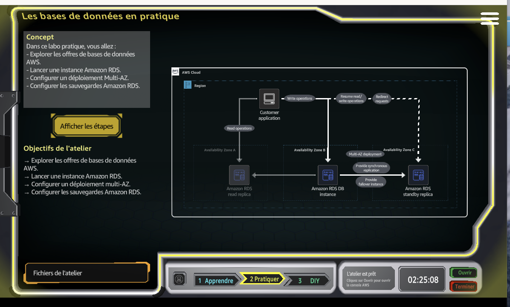
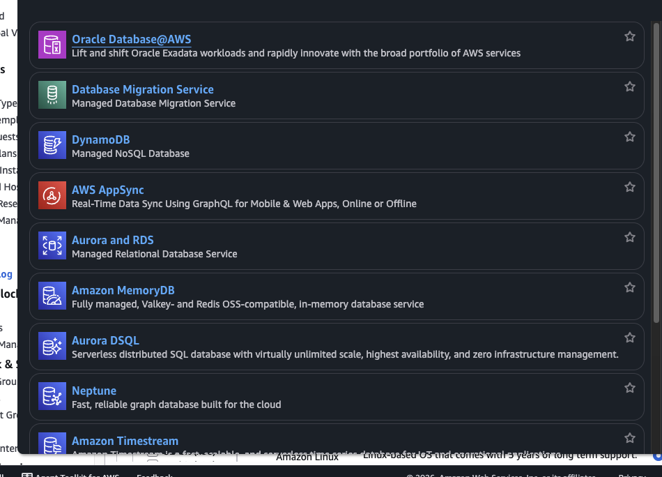
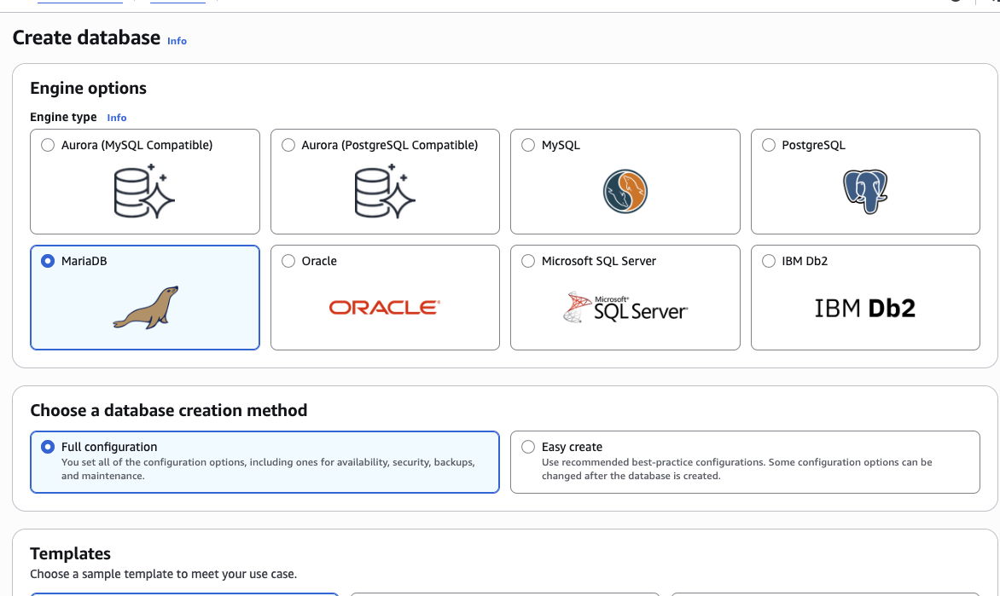
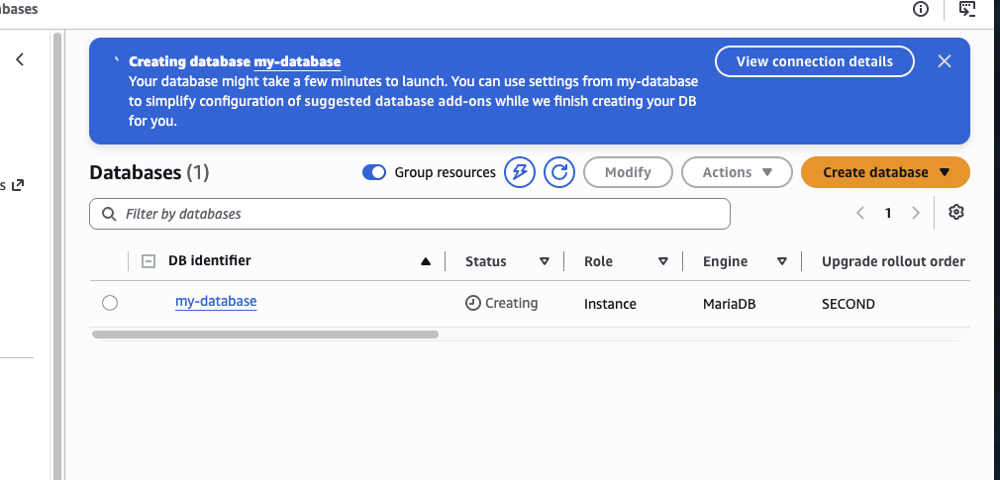
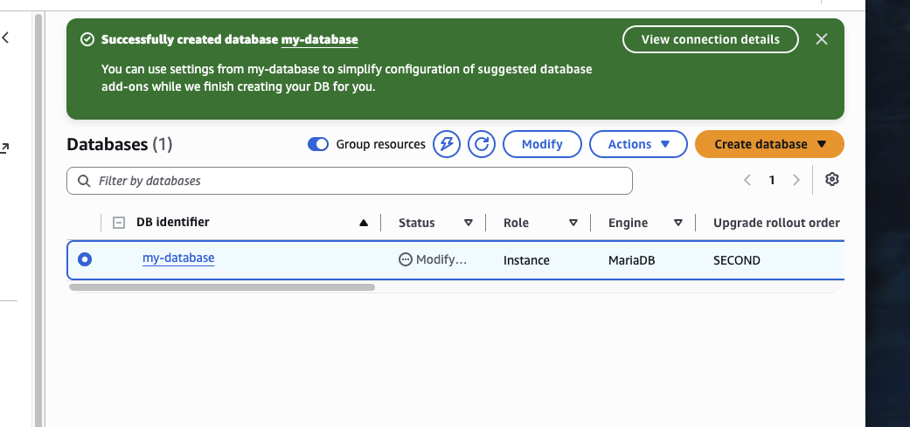
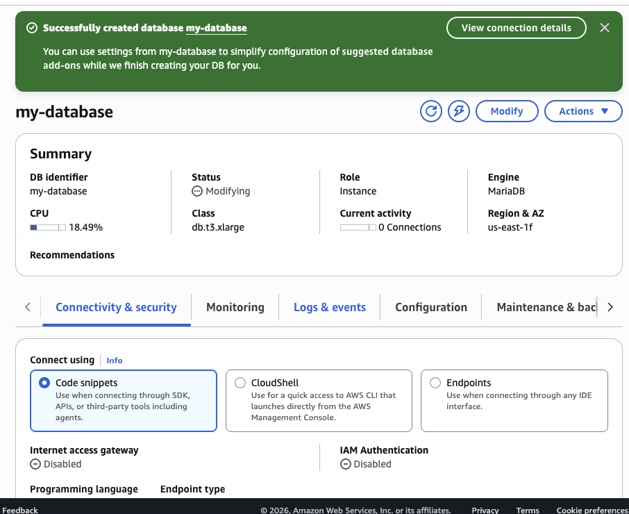

# AWS RDS MariaDB, Multi-AZ and Backup Fundamentals

Hands-on AWS Cloud Practitioner / Cloud Quest lab focused on **Amazon RDS**, managed relational databases, **Multi-AZ high availability**, **read replicas**, and **backup fundamentals**.

## Lab Objectives

- Explore AWS database services.
- Launch an Amazon RDS database.
- Understand Multi-AZ deployment.
- Understand RDS backup configuration.

## Architecture



The architecture separates three database roles:

```text
Customer Application
   |                 \
   | reads            \ writes
   v                   v
Read Replica       Primary RDS
                       |
                       | synchronous replication
                       v
                   Standby RDS
                 another AZ
```

### Key distinction

```text
Multi-AZ    = High availability / failover
Read replica = Read scaling
Backups     = Recovery
```

These features solve different problems and complement each other.

## 1. Explored AWS Database Services



The console showed several AWS database services, including:

- Amazon Aurora and RDS
- DynamoDB
- MemoryDB
- Neptune
- Timestream
- Database Migration Service
- Oracle Database@AWS

**Why it matters:** AWS provides different database technologies for relational, NoSQL, graph, in-memory, and time-series workloads.

## 2. Selected MariaDB in Amazon RDS



We selected **MariaDB** and used the **Full configuration** workflow.

The console also offered engines such as:

- Aurora MySQL-Compatible
- Aurora PostgreSQL-Compatible
- MySQL
- PostgreSQL
- Oracle
- Microsoft SQL Server
- IBM Db2

**Why Full configuration matters:** it exposes settings for availability, security, backups, instance class, storage, networking, and maintenance.

## 3. Created the Database

The database identifier used in the lab was:

```text
my-database
```



The RDS instance entered the **Creating** state with:

```text
DB identifier: my-database
Role: Instance
Engine: MariaDB
```

**Why creation takes time:** AWS is provisioning managed database infrastructure, storage, networking, engine configuration, and operational integrations.

## 4. Database Creation Completed



The console confirmed:

```text
Successfully created database my-database
```

This demonstrates one of the main RDS benefits: AWS handles much of the infrastructure work that would otherwise be performed manually on a self-managed database server.

## 5. Reviewed the RDS Instance Details



Visible configuration included:

```text
DB identifier: my-database
Engine: MariaDB
Class: db.t3.xlarge
Region / AZ: us-east-1f
Connections: 0
```

At the time of the screenshot, the database was still applying modifications.

### Why the DB class matters

The DB instance class determines compute capacity and affects:

- CPU
- memory
- throughput
- performance
- cost

## Multi-AZ vs Read Replica

### Multi-AZ

Primary purpose:

```text
High availability
Automatic failover
AZ resilience
```

Concept:

```text
Primary RDS
    |
    | synchronous replication
    v
Standby RDS
```

The standby exists mainly for failover, not for serving application read traffic.

### Read Replica

Primary purpose:

```text
Read scaling
Reporting
Analytics
Read-heavy workloads
```

Concept:

```text
Primary RDS
    |
    | replication
    v
Read Replica
```

### Comparison

| Feature | Multi-AZ | Read Replica |
|---|---|---|
| Main goal | High availability | Read scalability |
| Used for failover | Yes | Not primarily |
| Application reads from replica | Normally no | Yes |
| Helps scale read traffic | No | Yes |
| Protects against AZ failure | Yes | Different purpose |

## RDS Backup Fundamentals

The mission also introduced RDS backup concepts:

```text
Automated backups
Manual snapshots
Backup retention
Point-in-time recovery
```

### Important distinction

```text
Multi-AZ = Availability
Backup   = Recovery
```

A highly available database still needs backups.

Backups help recover from scenarios such as:

- accidental deletion
- unwanted data changes
- logical corruption
- recovery to an earlier point in time

## Why Amazon RDS Is Useful in Production

Amazon RDS reduces operational overhead by managing many infrastructure responsibilities, including:

- database provisioning
- operating-system maintenance
- engine patching
- backup automation
- snapshots
- monitoring integrations
- Multi-AZ failover
- storage management

This lets teams focus more on application logic, queries, data models, performance, and security.

## Production Architecture Idea

```text
Application
    |
    v
RDS Endpoint
    |
    +--> Primary DB
    |      |
    |      +--> Standby DB in another AZ
    |
    +--> Read Replica
```

A more complete production deployment could add:

- private subnets
- restrictive security groups
- AWS Secrets Manager
- AWS KMS encryption
- CloudWatch
- Performance Insights
- RDS Proxy
- automated snapshots
- cross-Region disaster recovery

## Security Considerations

Production databases should normally not be directly exposed to the public internet.

Preferred pattern:

```text
Internet
   |
   v
Application Tier
   |
   | database port
   v
RDS Security Group
   |
   v
Private RDS Database
```

Useful controls include:

- private subnets
- tightly scoped security groups
- encryption at rest
- TLS in transit
- Secrets Manager
- logging and monitoring

## Troubleshooting Workflow

When an application cannot connect to RDS:

```text
1. Check RDS status
2. Check endpoint
3. Check database port
4. Check VPC
5. Check subnet
6. Check security groups
7. Check route tables
8. Check credentials
9. Check engine availability
10. Review logs and monitoring
```

## Key AWS Concepts

| Concept | Purpose |
|---|---|
| Amazon RDS | Managed relational database service |
| MariaDB | Relational engine used in this lab |
| Multi-AZ | High availability and failover |
| Read Replica | Read scaling |
| Automated Backup | Recurring managed backups |
| Snapshot | Stored database backup |
| DB Instance Class | Database compute capacity |
| Availability Zone | Isolated location in an AWS Region |

## Cloud Practitioner Takeaways

- RDS is a managed relational database service.
- RDS supports multiple database engines.
- **Multi-AZ is mainly for high availability.**
- **Read replicas are mainly for read scaling.**
- Backups and Multi-AZ solve different problems.
- DB instance class affects both performance and cost.
- Production databases should normally live in private network tiers.
- Managed services reduce operational burden.

## Screenshots

| Screenshot | Description |
|---|---|
| `01-mission-architecture.png` | Primary RDS, standby instance, and read replica architecture |
| `02-aws-database-services.png` | AWS database service portfolio |
| `03-rds-engine-selection-mariadb.png` | MariaDB selected in the RDS creation workflow |
| `04-rds-database-creating.png` | `my-database` during provisioning |
| `05-rds-database-created.png` | Successful database creation |
| `06-rds-instance-details.png` | Final RDS details including MariaDB and `db.t3.xlarge` |

## Training Context

Completed in AWS Cloud Quest / AWS Skill Builder as part of **AWS Certified Cloud Practitioner** hands-on training.
