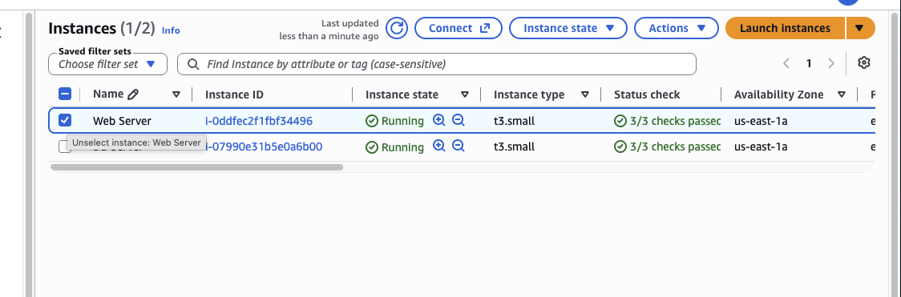
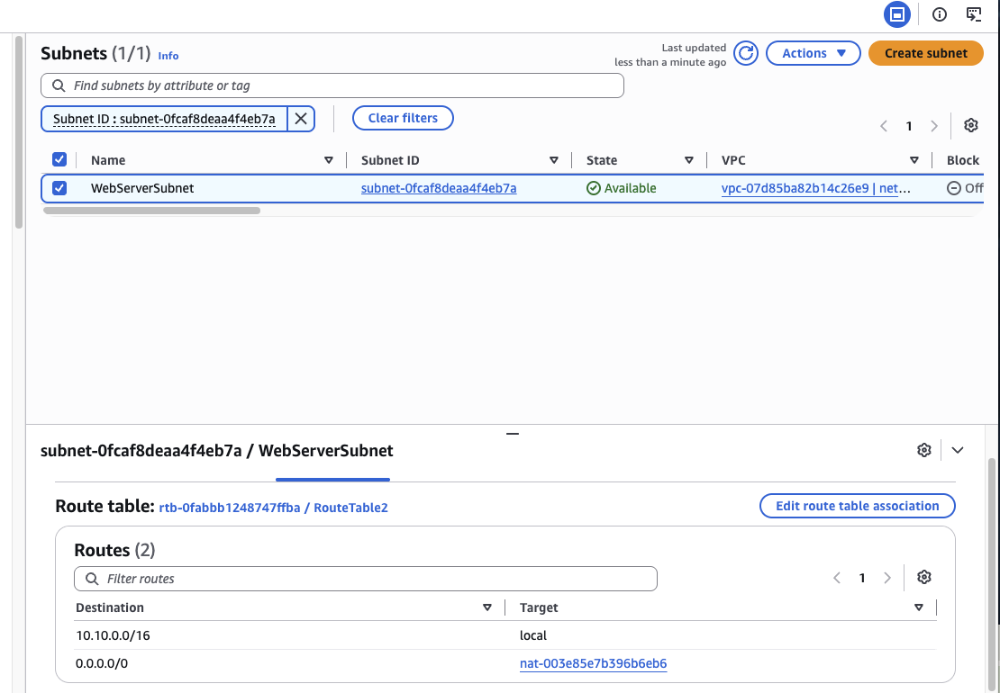
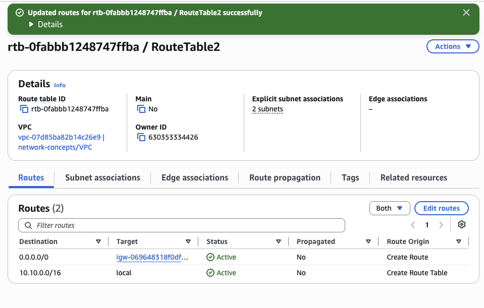
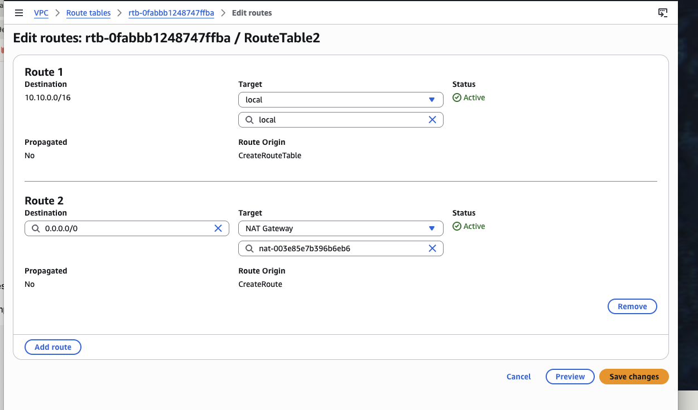
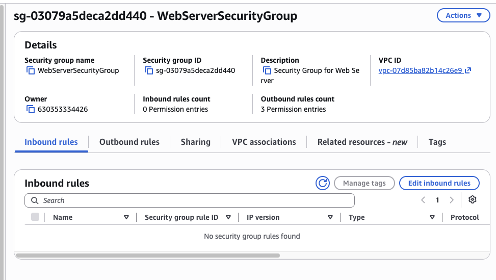
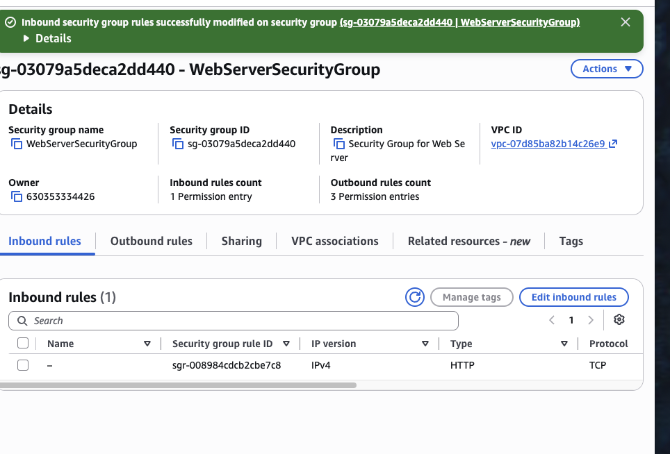
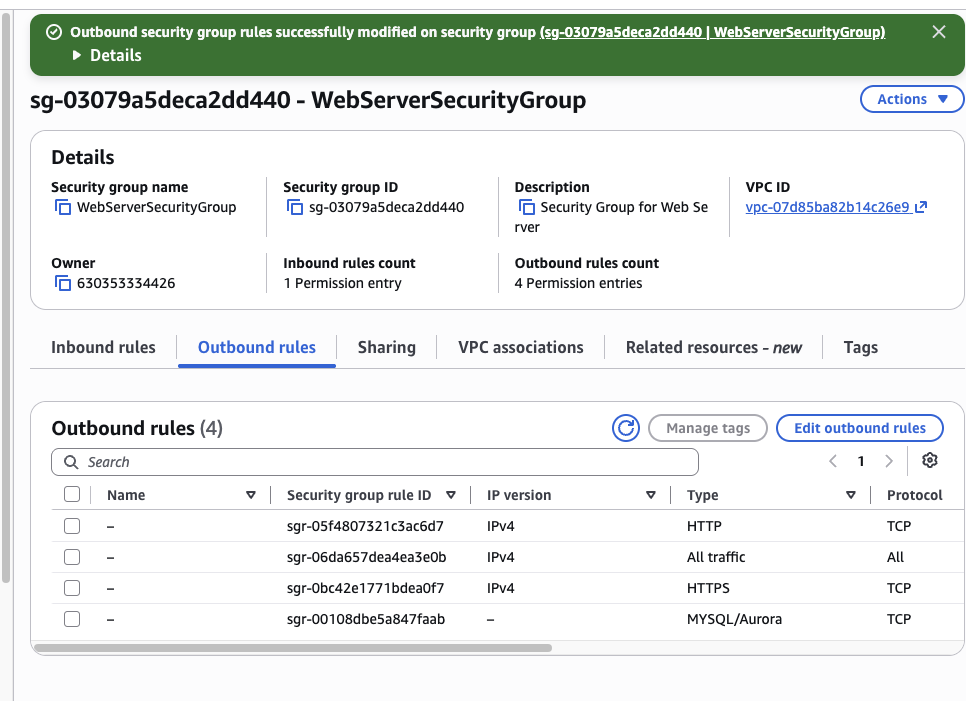
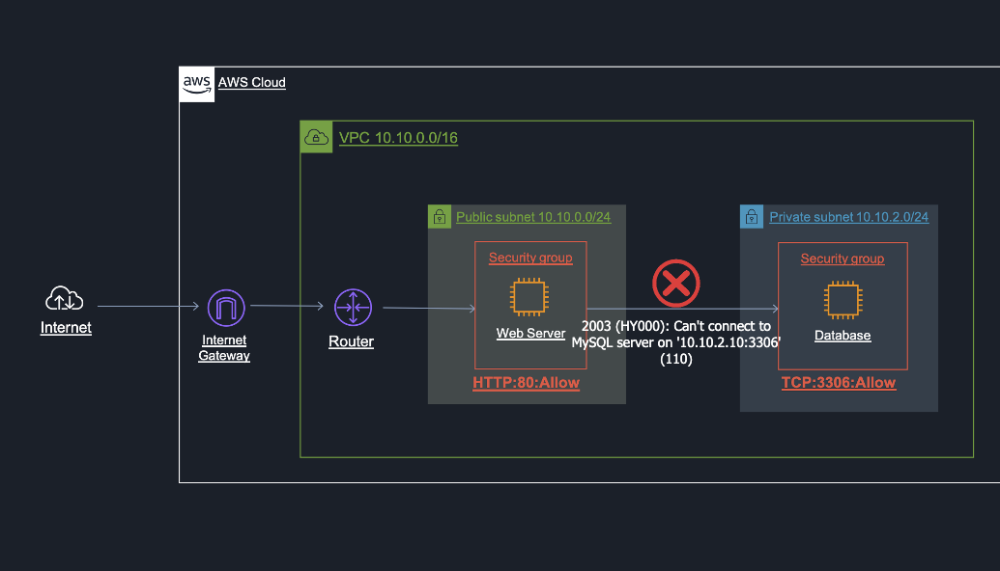

# AWS VPC Networking and Security Lab

Hands-on AWS Cloud Practitioner / Cloud Quest lab focused on **VPC networking, route tables, Internet connectivity, subnets, NAT, and security groups**.

The lab demonstrates how to separate a public-facing web tier from a private database tier and control network flows between them.

## Architecture

```text
Internet
   |
   v
Internet Gateway
   |
   v
VPC Router
   |
   +------------------------------+
   |                              |
   v                              v
Public Subnet                 Private Subnet
10.10.0.0/24                  10.10.2.0/24
   |                              |
   v                              v
Web Server  -----------------> Database Server
               TCP 3306
```

The web tier is internet-facing, while the database tier remains private.

## What We Did

### 1. Reviewed the EC2 resources

The lab included two running EC2 instances representing the web and database tiers.



**Why it matters:** separating application tiers allows different network exposure and security policies.

### 2. Reviewed subnet and route-table association

We inspected the `WebServerSubnet` and the route table associated with it.



The route table included:

```text
10.10.0.0/16 -> local
0.0.0.0/0    -> NAT Gateway
```

**Why it matters:** route tables determine where traffic from a subnet is forwarded. The `local` route is automatically created and enables communication inside the VPC.

### 3. Added a default route to an Internet Gateway

We configured another route table with:

```text
0.0.0.0/0 -> Internet Gateway
```



This is the classic route used by a public subnet.

### 4. Reviewed a NAT Gateway route

We also reviewed a route table using a NAT Gateway as the default target.



**Why it matters:** a NAT Gateway is commonly used by private-subnet workloads that need outbound internet access without accepting direct inbound internet connections.

### 5. Reviewed the Web Server Security Group before adding HTTP

The `WebServerSecurityGroup` initially had no inbound rule configured.



Security groups are stateful virtual firewalls. Traffic is blocked unless an inbound rule explicitly permits it.

### 6. Added inbound HTTP access

We added an inbound HTTP rule to the web-server security group.



Important configuration:

```text
Type: HTTP
Protocol: TCP
Port: 80
```

This allows users to reach the public web server over HTTP.

### 7. Reviewed outbound rules

We inspected the web-server security group's outbound rules.



The configuration included outbound entries for HTTP, HTTPS, MySQL/Aurora, and all traffic.

For this multi-tier design, the important application flow is:

```text
Web Server -> Database Server
TCP 3306
```

### 8. Troubleshot database connectivity

During testing, the web server returned:

```text
2003 (HY000): Can't connect to MySQL server on '10.10.2.10:3306'
```



This highlights a realistic network troubleshooting scenario. Possible causes include:

- database security group not allowing TCP/3306;
- incorrect security-group source;
- route-table issue;
- network ACL blocking the connection;
- database service not listening.

## Security Model

A secure pattern is:

```text
Internet
   |
   | TCP 80
   v
Web Server Security Group
   |
   | TCP 3306
   v
Database Security Group
```

The database should not expose TCP/3306 directly to `0.0.0.0/0`.

Instead, database access should be limited to the trusted web/application tier.

## Public vs Private Subnet

### Public subnet

Typical route:

```text
0.0.0.0/0 -> Internet Gateway
```

Used for internet-facing workloads such as public web servers and load balancers.

### Private subnet

Private resources do not accept direct inbound internet traffic.

They may use:

```text
0.0.0.0/0 -> NAT Gateway
```

for outbound internet access.

## Key AWS Concepts

| AWS Component | Purpose |
|---|---|
| Amazon VPC | Isolated virtual network |
| Subnet | Segments VPC address space |
| Public Subnet | Uses an Internet Gateway route |
| Private Subnet | No direct inbound internet exposure |
| Route Table | Controls traffic forwarding |
| Internet Gateway | Connects VPC resources to the internet |
| NAT Gateway | Outbound internet access for private resources |
| Security Group | Stateful resource-level firewall |
| TCP 80 | HTTP traffic |
| TCP 3306 | MySQL / Aurora traffic |

## Production Relevance

This architecture demonstrates basic **network segmentation** and **defense in depth**.

Benefits include:

- reduced attack surface;
- separation of public and private workloads;
- controlled east-west traffic;
- clearer security boundaries;
- easier troubleshooting.

A more complete production design could add:

- Application Load Balancer;
- Auto Scaling;
- multiple Availability Zones;
- AWS WAF;
- VPC Flow Logs;
- Network ACLs;
- CloudWatch;
- Amazon RDS.

## Troubleshooting Workflow

When connectivity fails:

```text
1. Check instance state
2. Check subnet
3. Check route table
4. Check Internet/NAT Gateway
5. Check Security Group
6. Check Network ACL
7. Check destination service and port
8. Test again
```

## Screenshots

| Screenshot | Description |
|---|---|
| `01-web-sg-before-rule.png` | Web Security Group before HTTP inbound access |
| `02-public-route-table-igw.png` | Default route to an Internet Gateway |
| `03-connectivity-troubleshooting.png` | MySQL connectivity failure between web and DB tiers |
| `04-private-route-table-nat.png` | Default route to a NAT Gateway |
| `05-web-sg-http-inbound.png` | HTTP inbound rule on the web tier |
| `06-web-sg-outbound.png` | Web Security Group outbound rules |
| `07-subnet-route-association.png` | Subnet and associated route table |
| `08-ec2-web-db-instances.png` | Running EC2 web and database instances |

## Cloud Practitioner Takeaways

- A VPC is the main networking boundary in AWS.
- A subnet belongs to one Availability Zone.
- The `local` route enables VPC-internal communication.
- `0.0.0.0/0 -> Internet Gateway` is a standard public-subnet route.
- NAT Gateway is mainly used for outbound internet access from private subnets.
- Security groups are stateful.
- Only required ports should be exposed.
- Databases should normally stay private.

## Training Context

Completed in AWS Cloud Quest / AWS Skill Builder as part of AWS Certified Cloud Practitioner hands-on training.
