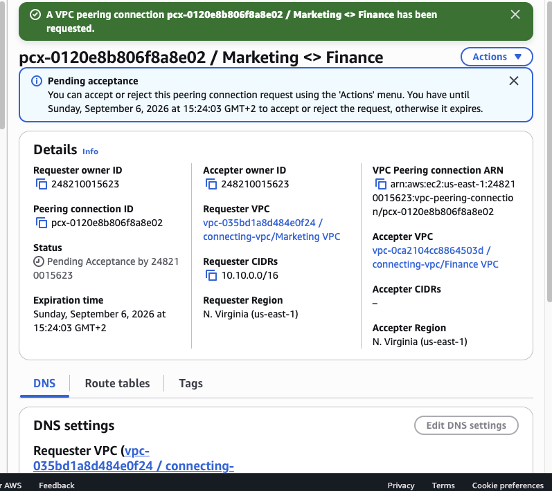
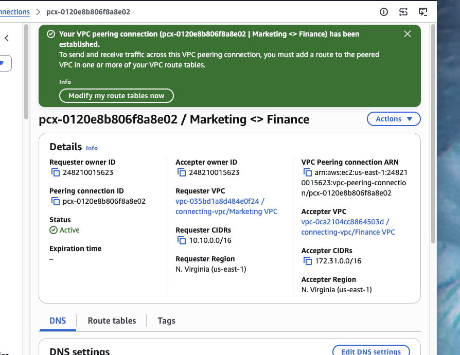
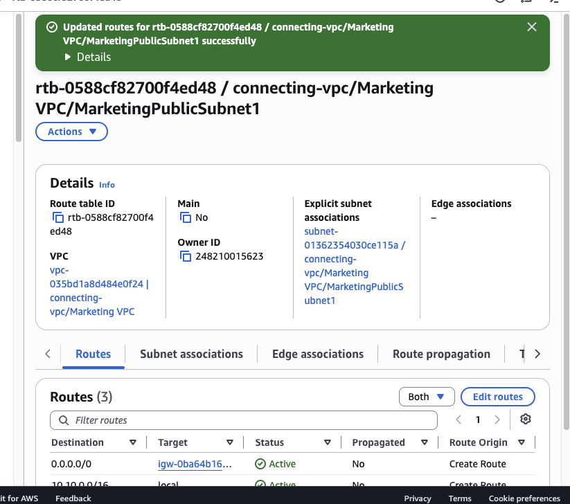
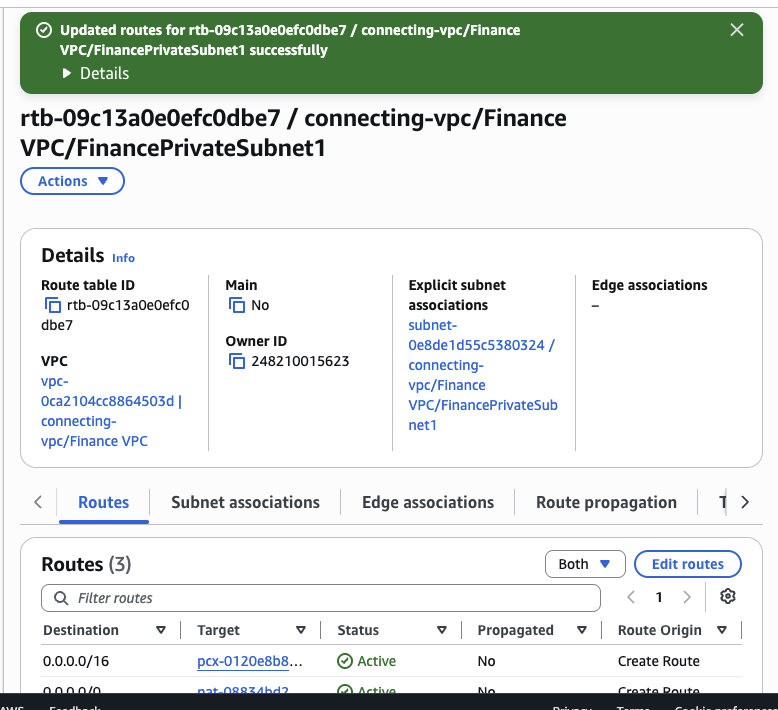
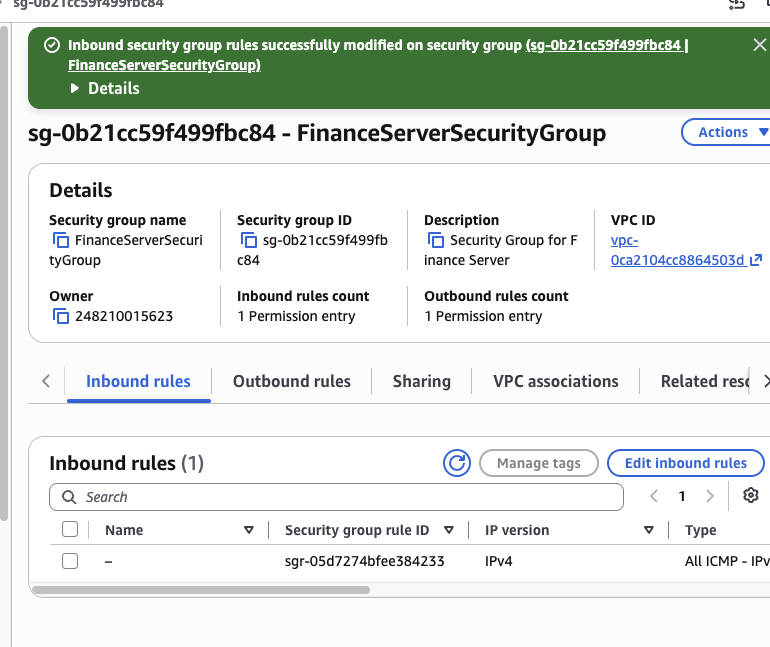
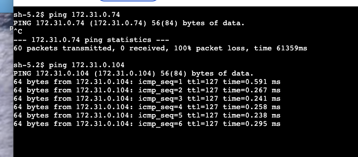

# AWS VPC Peering, Routing and Connectivity Lab

## Overview

This lab demonstrates how to connect two Amazon VPCs using **VPC Peering** and make resources in the two networks communicate privately.

The environment contains two VPCs:

- **Marketing VPC** — `10.10.0.0/16`
- **Finance VPC** — `172.31.0.0/16`

The lab required more than simply creating the peering connection. I also had to configure **bidirectional routing**, update the **FinanceServer security group** to allow ICMP traffic from the Marketing VPC, and validate the connection from the Marketing server using `ping`.

This was also a useful troubleshooting exercise because the first connectivity tests failed until both the routing and the correct FinanceServer private IP were verified.

---

## Lab Objectives

- Create a VPC peering connection
- Connect the Marketing and Finance VPCs
- Configure route tables in both directions
- Allow ICMP traffic through the Finance server security group
- Test private connectivity between EC2 instances
- Troubleshoot routing and addressing issues

---

## AWS Services and Concepts Used

- Amazon VPC
- VPC Peering
- Route Tables
- CIDR blocks
- Security Groups
- Amazon EC2
- AWS Systems Manager Session Manager
- ICMP / Ping
- Private IPv4 addressing

---

## Architecture

```text
Marketing VPC
10.10.0.0/16
       |
       | Route:
       | 172.31.0.0/16
       v
+-------------------------+
|   VPC Peering Connection|
| pcx-0120e8b806f8a8e02   |
+-------------------------+
       |
       | Route:
       | 10.10.0.0/16
       v
Finance VPC
172.31.0.0/16
       |
       v
FinanceServer
172.31.0.104
```

The peering connection does not automatically add routes or security-group permissions. Those must be configured explicitly.

---

# Walkthrough

## 1. Start the VPC connectivity lab

The lab objective was to configure VPC peering and verify that traffic could be correctly routed between the peered VPCs.


The important design idea is that the two VPC CIDR ranges do not overlap:

```text
Marketing: 10.10.0.0/16
Finance:   172.31.0.0/16
```

Non-overlapping CIDRs are required for VPC peering.

---

## 2. Create the VPC peering request

I created a peering connection named:

```text
Marketing <-> Finance
```

The request initially entered the **Pending acceptance** state.



The connection used:

- **Requester VPC:** Marketing VPC
- **Requester CIDR:** `10.10.0.0/16`
- **Accepter VPC:** Finance VPC
- **Accepter CIDR:** `172.31.0.0/16`

---

## 3. Accept and activate the peering connection

After accepting the request, the peering connection became **Active**.



The connection ID used during the lab was:

```text
pcx-0120e8b806f8a8e02
```

At this point the VPCs were logically peered, but traffic still required explicit routing.

---

## 4. Configure the Marketing VPC route table

The Marketing subnet route table was updated so traffic destined for the Finance VPC would be sent through the peering connection.



The important route is conceptually:

```text
Destination: 172.31.0.0/16
Target:      pcx-0120e8b806f8a8e02
```

This tells AWS:

> When a resource in the Marketing VPC needs to reach a `172.31.x.x` address, send the traffic through the VPC peering connection.

---

## 5. Configure the Finance VPC return route

The Finance private subnet route table also required a return route toward the Marketing VPC.



The return route is:

```text
Destination: 10.10.0.0/16
Target:      pcx-0120e8b806f8a8e02
```

This bidirectional routing is essential.

```text
Marketing -> Finance
10.10.0.0/16 -> 172.31.0.0/16

Finance -> Marketing
172.31.0.0/16 -> 10.10.0.0/16
```

A peering connection alone is not enough if only one side has a route.

---

## 6. Allow ICMP in the Finance server security group

The Finance server still needed to allow the test traffic.

I modified `FinanceServerSecurityGroup` to allow **All ICMP - IPv4** from the Marketing VPC CIDR.



The important rule was:

```text
Type:   All ICMP - IPv4
Source: 10.10.0.0/16
```

This allows hosts inside the Marketing VPC to send ICMP traffic to the Finance server.

---

## 7. Validate VPC peering with ping

The final test was performed from the MarketingServer through an AWS Systems Manager Session Manager terminal.

The first test used `172.31.0.74`, which was not the current FinanceServer private IP and resulted in **100% packet loss**.

After checking the EC2 instance details, the correct private IP was identified as:

```text
172.31.0.104
```

The new test succeeded:

```bash
ping 172.31.0.104
```



The successful replies confirmed that:

- the peering connection was active
- the Marketing route was correct
- the Finance return route was correct
- the Finance security group allowed ICMP
- the correct private destination IP was being used

---

# Troubleshooting Lessons

## Wrong destination CIDR in the Finance route table

During the lab, a route was initially configured with:

```text
0.0.0.0/16
```

instead of:

```text
10.10.0.0/16
```

This prevented the Finance VPC from having the correct return path toward the Marketing VPC.

### Lesson

Route-table destination CIDRs must represent the **remote network that should be reached through the peering connection**.

---

## Pinged the CIDR instead of a host address

An early command used a `/16` suffix with `ping`.

Example of an invalid host target:

```bash
ping 172.31.0.74/16
```

CIDR notation describes a network, not an individual host.

A host test must use only the IP address:

```bash
ping 172.31.0.104
```

---

## Wrong FinanceServer private IP

The course screenshot showed `172.31.0.74`, but the live lab environment assigned the FinanceServer:

```text
172.31.0.104
```

This is an important cloud-lab lesson: **do not blindly copy resource IDs or IP addresses from training screenshots**. Always verify the values in the current AWS environment.

---

# Key Concepts Learned

## VPC Peering

VPC Peering creates private network connectivity between two VPCs.

Traffic remains on the AWS network and does not require public IP addresses or the public Internet.

## Peering is not transitive

VPC peering is a one-to-one relationship.

If:

```text
VPC A <-> VPC B
VPC B <-> VPC C
```

that does not automatically mean:

```text
VPC A <-> VPC C
```

A separate connection or another networking architecture would be required.

## Non-overlapping CIDRs

The connected VPCs need non-overlapping address ranges.

In this lab:

```text
10.10.0.0/16
172.31.0.0/16
```

do not overlap.

## Bidirectional routing

Both VPCs need routes to the remote CIDR.

## Security groups still apply

A valid network route does not override a security group.

The destination EC2 instance must still permit the traffic.

---

# Production Relevance

VPC peering can be useful when separate AWS networks need private communication, for example:

- application VPC to shared-services VPC
- development VPC to internal tooling
- business-unit VPC interconnection
- security monitoring networks
- management networks
- privately shared application services

For environments with many VPCs and more complex connectivity requirements, **AWS Transit Gateway** may provide a more scalable hub-and-spoke design.

---

# Skills Demonstrated

- VPC peering configuration
- CIDR planning
- AWS route-table configuration
- Bidirectional routing
- Security-group configuration
- EC2 private networking
- Systems Manager Session Manager
- ICMP connectivity testing
- AWS networking troubleshooting
- Validation of live cloud resource values

---

# Repository Structure

```text
aws-vpc-peering-routing-connectivity-lab/
├── README.md
└── screenshots/
    ├── 01-lab-overview.png
    ├── 02-vpc-peering-request-pending.png
    ├── 03-vpc-peering-active.png
    ├── 04-marketing-route-table.png
    ├── 05-finance-route-table.png
    ├── 06-finance-security-group-icmp.png
    └── 07-vpc-peering-ping-validation.png
```

---

# AWS Cloud Practitioner Takeaways

- VPC peering provides private connectivity between VPCs.
- Peered VPCs must use non-overlapping CIDR ranges.
- Route tables must be updated to send traffic through the peering connection.
- Routing must work in both directions.
- Security groups continue to control allowed traffic.
- VPC peering is not transitive.
- Private IP addresses can be used for communication across a VPC peering connection.
- Always verify live AWS resource values instead of copying example IP addresses from documentation.

---

# Conclusion

This lab created private connectivity between a Marketing VPC and a Finance VPC using **Amazon VPC Peering**.

I established and accepted the peering connection, configured route tables in both directions, allowed ICMP traffic through the Finance server security group, and validated connectivity from the MarketingServer to the FinanceServer.

The troubleshooting steps were especially valuable because they demonstrated that successful cloud networking depends on several layers working together:

```text
Peering connection
        +
Route tables
        +
Security groups
        +
Correct destination address
        =
Successful private connectivity
```
